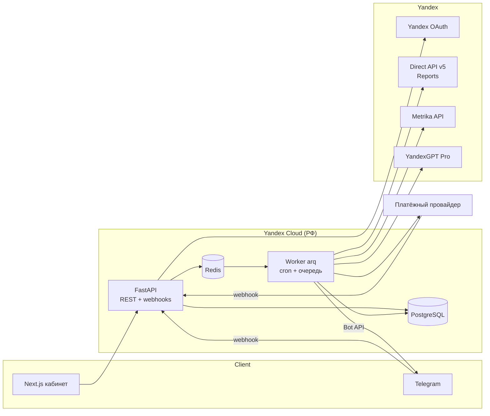

# Архитектура MVP — v0.1

> Основа: [PRD.md](PRD.md). Принцип: минимум движущихся частей, которые реально нужны на 3 недели и первые сотни клиентов. Всё, что отложено, помечено «потом» с условием, когда добавлять.

## 1. Общая схема



**Три процесса одного кодбейза:** `api` (FastAPI), `worker` (arq), `web` (Next.js). Плюс PostgreSQL и Redis.

| Решение | Почему | Потом |
|---|---|---|
| Монолит бэкенда: api + worker из одного пакета | 3 недели, один разработчик; общий контракт данных и модели | Выделять сервисы, когда появится независимое масштабирование |
| arq (Redis) для фоновых задач и расписаний | Redis уже в стеке; async как FastAPI; cron встроен — не нужен Celery + beat | — |
| Telegram-бот = webhook-роут в FastAPI, отправка из worker | Не нужен отдельный процесс бота | — |
| AI-слой = отдельный модуль с одной точкой входа, не отдельный сервис | LLM теперь в РФ (YandexGPT), причина выносить в отдельный контур ушла; граница обеспечивается кодом и тестом (§6) | Отдельный сервис — если вернётся зарубежная модель |

## 2. Конвейер данных (сердце системы)

```
[sync]  Директ + Метрика ──▶ парсер ──▶ allowlist полей + санитизация ПД ──▶ snapshot (неизменяемый) + stat_rows
[audit] snapshot ──▶ rule engine (чистые функции, версии правил) ──▶ findings = структурированные рекомендации
[explain] findings ──▶ обезличивание ──▶ YandexGPT ──▶ проверка чисел ──▶ explanation (сохраняется)
[recommend] finding + explanation ──▶ recommendation ──▶ человек ──▶ выполнение ──▶ журнал
[notify] сравнение со снимком дайджеста ──▶ Telegram (уточнение / новая проблема / критично)
[verify] +7 дней после «Я сделал это» ──▶ результат рекомендации, «Сэкономлено ≈»
```

Каждый шаг пишет в БД и ссылается на `snapshot_id` / `rule_version`. Повторный запуск шага на том же снимке даёт тот же результат (кроме текста LLM — он сохранён, не перегенерируется).

### 2.1 Решение принимает ядро, AI только объясняет
Rule engine выдаёт структурированную рекомендацию — это и есть решение:
```json
{"rule": "high_cpa_target@3", "object": {"type": "campaign", "id": 12345},
 "evidence": {"actual_cpa": 4820, "target_cpa": 3000, "clicks": 487, "conversions": 19, "days": 7},
 "action": {"type": "decrease_bid", "change_pct": -15},
 "confidence": "medium", "snapshot_id": 84721, "code_version": "a1b2c3d"}
```
AI превращает это в текст: «CPA кампании выше порога на 61%. Рекомендуется снизить ставку на 15%.» Все числа текста — из `evidence`/`action`.

### 2.2 Цепочка воспроизводимости (обязательные связи)
```
Recommendation #582
  ├── snapshot_id       #84721 · 29.09.2026 09:03 · какие данные были (в т.ч. source каждого значения)
  ├── rule_version      high_cpa@3 · threshold = 3 000 ₽ · какое правило действовало
  ├── release_id        commit_sha + build_id + released_at · каким кодом посчитано
  ├── finding           CPA = 4 820 ₽ → action −15% · какой вывод получился
  └── explanation_id    #1 · какой текст увидел клиент
```
- `data_source` отдельной сущностью не вводим: `source` уже есть в каждом `Value` контракта.
- Вместо ручного `calculation_version` — запись `release` (`commit_sha`, `build_id`, `released_at`), создаётся автоматически при деплое. SHA точно указывает код, `build_id` различает сборки одного коммита. Параметры правил (пороги) версионируются явно через `rule_version` — их меняют намеренно.
- Настройки клиента, которые читали правила (целевой CPA, средний чек, пороги уведомлений), замораживаются копией в `audit_run` — иначе изменение настроек «переписало бы» объяснение старого вывода.
- Внешние ключи `NOT NULL` — рекомендацию без снимка, правила и объяснения создать нельзя.

### 2.3 Неизменяемость — технически, а не на словах
- Таблицы доказательной цепочки (`snapshot`, `stat_row`, `finding`, `explanation`, `recommendation_event`) — **append-only**: роль БД приложения имеет только `SELECT, INSERT` (`GRANT`), плюс триггер, запрещающий `UPDATE/DELETE`. Приложение не может переписать историю даже с багом в коде.
- Статус рекомендации не обновляется «на месте» — каждое действие человека (одобрил, отклонил, выполнил) = новая строка `recommendation_event`. Текущий статус = последнее событие.
- Удаление данных (аккаунт, политика хранения) — **отдельный процесс под отдельной ролью БД**, оформленный объектом `deletion_request` (§2.5).
- **Роли БД:**

  | Роль | Права | Кто использует |
  |---|---|---|
  | `app_rw` | `SELECT, INSERT` на доказательные таблицы; `SELECT, INSERT, UPDATE` на операционные; **без** `DELETE` и DDL. На подключениях — все столбцы, кроме шифротекста токена (`SELECT *` недоступен); токен пишется и сбрасывается функциями `set_connection_token` / `drop_connection_token` | api |
  | `app_token` | член `app_rw` + `EXECUTE connection_token(kind, workspace, connection)` — чтение токена только в пределах переданного workspace | worker |
  | `app_deleter` | **никаких прав на таблицы** — только `EXECUTE delete_workspace_data` и `purge_search_query_texts` (`SECURITY DEFINER`, фиксированный `search_path`) | worker удаления и хранения |
  | `app_migrator` | владелец всех таблиц, DDL | только alembic при деплое |

  Роли и членство `GRANT app_rw TO app_token` создаются на уровне кластера (как в `tests/conftest.py`). Append-only триггеры пропускают `DELETE` только внутри функций удаления (транзакционная метка `app.deleting`); подделать метку бесполезно — ни у одной рабочей роли нет права `DELETE` на эти таблицы.

  `app` не владелец таблиц — значит не может `ALTER TABLE`, отключить триггер или снять `GRANT`. Пароль `migrator` не доступен работающему приложению.
- **Хэш-цепочка событий — не в MVP.** Хэш-цепочка в той же БД, которой управляет тот же оператор, ничего не доказывает третьей стороне: при желании её можно пересчитать целиком. Реальную защиту даёт append-only по правам БД (выше). Хэш-цепочку с внешней фиксацией (например, периодическая публикация корневого хэша) добавим, когда корпоративный клиент потребует доказуемый аудит — схема событий к этому готова.

### 2.4 Минимизация данных и 152-ФЗ
Принцип: **храним только минимальный набор данных, необходимый для заявленных функций продукта.** Отказ от хранения сырых ответов — часть этого принципа, но сам по себе соответствия 152-ФЗ не означает; итоговую политику обработки ПД утверждает юрист.

```
Ответ API → парсер → классификация полей → allowlist → санитизация → snapshot
```
- **Allowlist, не blacklist.** Для каждого отчёта Директа/Метрики в коде явно перечислены сохраняемые поля (ID объектов, даты, числовые метрики, тексты запросов/площадок). Всё, чего нет в списке, отбрасывается парсером. Новое поле API само в снимок не попадёт.
- **Санитизация свободного текста** (единственное такое поле в MVP — текст поискового запроса), до записи в снимок: телефоны, email, URL с параметрами, последовательности из 5+ цифр (номера заказов, ИНН, паспорта), строки после маркеров «ИНН», «ул», «д.», «кв.» → `***`. Имена людей надёжно регулярками не ловятся — поэтому второй барьер:
  - тексты запросов **никогда не отправляются в LLM** (в промпт — только ID и числа; объяснение для минус-слов строится шаблоном);
  - тексты запросов хранятся **60 дней** для проведения исторического анализа, сравнения результатов аудита и проверки эффекта рекомендаций (окно аудита 30 дней + проверка результата 7+7 дней + запас). По истечении срока текст удаляется через тот же механизм `deletion_request`, обезличенные агрегаты сохраняются; Реализация — `app/worker/retention.py` + `purge_search_query_texts(cutoff, batch)`: срок считается от последнего дня, в который запрос был в отчёте (`search_query_sightings.seen_on`); дата отсечения вычисляется в часовом поясе данных (Europe/Moscow) и передаётся явно; удаление пачками, каждая пачка — запись `deletion_requests` (`system:retention`); снимки и агрегаты `stat_rows` остаются.
  - если понадобится сильнее — NER для русского (библиотека Natasha) в том же слое санитизации, без изменений архитектуры.
- Сырые ответы API не хранятся. В логах — только ID, статусы и тайминги, без содержимого ответов и без токенов.
- **Всё это — автотесты, а не только документация:** модели парсеров с `extra="forbid"` + тест, сверяющий набор сохраняемых полей с замороженным списком (новое поле → тест падает, пока его осознанно не добавят в allowlist); тест санитизации; тест, что в промпт LLM не попадают тексты запросов.

### 2.5 Политика хранения и удаления данных (черновик для юриста)
| Данные | Цель | Где | Срок | Триггер удаления | Способ |
|---|---|---|---|---|---|
| Сырой ответ API | — | не хранится | 0 | — | — |
| OAuth-токен | подключение | PostgreSQL (шифр.) | пока подключение активно | отключение, отзыв, удаление аккаунта | DELETE |
| Email, Яндекс UID | вход, уведомления | PostgreSQL | пока жив аккаунт | удаление аккаунта | DELETE |
| Снимок (агрегаты) | аудит, воспроизводимость | PostgreSQL | пока жив workspace; без ссылок — 30 дней | удаление workspace / истечение | DELETE (роль удаления) |
| Тексты поисковых запросов | рекомендации минус-слов | PostgreSQL | 60 дней | истечение / удаление workspace | DELETE |
| Рекомендации, события, объяснения | история решений | PostgreSQL | пока жив workspace | удаление workspace | DELETE (роль удаления) |
| Банковские/карточные реквизиты | — | **не храним** (только токен способа оплаты у провайдера) | 0 | — | — |
| Токен способа оплаты провайдера | автопродление | PostgreSQL | пока подписка с автопродлением | отмена, удаление аккаунта | DELETE |
| `transaction_id` провайдера, суммы, даты | сверка платежей, споры | PostgreSQL | **уточнить с бухгалтером** | — | — |
| Бухгалтерские документы (чеки 54-ФЗ, акты, счета) | бухучёт (402-ФЗ) | у провайдера / в бухгалтерии; уточнить, какие формируем сами | не менее 5 лет после отчётного года — **только для документов бухучёта** | — | — |
| История подписки | поддержка, споры | PostgreSQL | пока жив аккаунт | удаление аккаунта | DELETE |
| Отметка «бесплатный аудит использован» | лимит «1 на аккаунт Директа» | PostgreSQL, **хэш** логина Директа с секретной солью, без самого логина | бессрочно | — | ПД не содержит |
| `deletion_request` | подтверждение удаления | PostgreSQL | 3 года | — | без ПД удалённого клиента |
| Очереди, кэш, дедупликация | работа задач | Redis | TTL ≤ 7 дней | TTL | автоматически |
| Логи приложения | отладка, безопасность | Yandex Cloud Logging | 30 дней | TTL | автоматически |
| Бэкапы БД | восстановление | Managed PostgreSQL | 7 дней | ротация | удалённые данные исчезают из бэкапов по истечении срока ротации — это явно пишем в политике |

В MVP нет object storage, аналитики третьих сторон и реплик вне Managed PostgreSQL. Появятся — строка в эту таблицу до запуска.

**Деактивация ≠ удаление данных.**
```
ACCOUNT_DEACTIVATED        доступ закрыт · OAuth-токены отозваны и удалены · синхронизация и аудит остановлены
DATA_DELETION_COMPLETED    данные фактически уничтожены по scope запроса и проверены
```
Удаление — объект `deletion_request` со статусами `requested → scheduled → deleting → verified → completed` (или `failed`). Проверка (`verified`) — повторный запрос к каждому хранилищу по scope: 0 строк в PostgreSQL, 0 ключей в Redis; для логов и бэкапов фиксируется дата, когда истечёт их срок хранения. Удаление по сроку хранения (тексты запросов, снимки без ссылок) — тоже `deletion_request` с `requested_by = system:retention`. Срок исполнения запроса клиента — не более 30 дней (проверить с юристом).

### 2.6 Синхронизация
- Источник: Direct Reports API (offline-режим: `201/202` + `retryIn` → опрос), Metrika Reporting API.
- `DirectApi` (`app/sources/direct.py`, только чтение): `POST /json/v501/reports`, `Client-Login` в заголовке, `returnMoneyInMicros: false`, без заголовка отчёта и итоговой строки (строка столбцов остаётся — по ней парсер сверяет ответ). `ReportName = ai-direct:<sync_run_id>:<тип>` — стабилен между повторами 201/202, новый у каждой синхронизации. Цели и модель атрибуции — из `ConversionDefinition`. Коды ошибок → классы источника: 53 → `token_expired`, 513 → `permission_missing`, 54/8800/3000 → недоступность аккаунта; 52/152/506/1000–1002, 5xx, сеть → `RetryLater`; прочие (8000, 8312) → `invalid_request` с `sync_runs.provider_request_id`. Лимиты пользователя Яндекса (20 запросов / 10 с, 5 офлайн-отчётов) — общий ограничитель на Redis вместе с очередью задач.
- `DirectApi`: интервал повторной проверки — из заголовка ответа `retryIn` (не фиксированная пауза; задача переставляется в очередь arq на `retryIn` секунд, а не спит). В офлайн-очереди — не больше 5 отчётов на пользователя (`reportsInQueue`). Деньги — `returnMoneyInMicros: false` → рубли с двумя знаками, `Decimal`.
- Каждый запуск создаёт **новый снимок**, старые не меняются.
- **Глубина:** каждый снимок самодостаточен и содержит последние **37 дней** (7 оцениваемых + 30 baseline, PRD §4.1) — правила не склеивают данные из разных снимков.
- **Окно досчёта:** последние `N` дней снимка (по умолчанию 3; проверить реальное окно дозачёта конверсий Директа на живых данных) → `data_status = partial`, старше → `complete`.
- Расписание (МСК): 06:00 основная синхронизация + аудит → 09:00 дайджест → 14:00 и 20:00 досинхронизация (события «уточнение» / «новая проблема»).
- Лимиты API Директа (баллы) — очередь по одному аккаунту за раз, учёт заголовка `Units`, экспоненциальный повтор при ошибках. Ошибки → статус интеграции (§5 PRD «Интеграции»).

### 2.7 Адаптеры источников
```python
class DirectSource(Protocol):
    def fetch_report(self, login: str, spec: ReportSpec, conversions: ConversionSettings,
                     date_from: date, date_to: date) -> str: ...   # сырой TSV Reports API
```
Источник отдаёт сырой ответ, разбор — отдельно (`sync/parse.py`): allowlist-парсер сверяет строку столбцов с запрошенными полями, лишний или пропавший столбец — ошибка формата. Так новое поле API не может попасть в снимок через адаптер.
Три реализации с первого дня: `DirectApi` (боевой), `DirectSandbox`, `DirectFixture` (JSON-фикстуры для тестов и разработки до одобрения заявки). Выбор — переменной окружения. То же для Метрики. **Разработка не ждёт одобрения API.**

### 2.8 Метрика
- Reports API `/stat/v1/data/bytime`, `group=day`, `accuracy=full`, без dimensions → строки `site_goal` (`campaign_id = NULL`, `object_id = goal_id`). Logs API не используем.
- `ConversionDefinition` (счётчик, цели, атрибуция) — одно на оба запроса: в Директ уходят `Goals` + `AttributionModels`, в Метрику — метрики `ym:s:goal<id>reaches` + `attribution`. Копия хранится в `snapshots.conversion_definition`.
- Модели атрибуции — только те, что API считают сами: `cross_device_last_significant` (Директ `LSCCD`, по умолчанию), `last` (`LC`), `cross_device_first` (`FCCD`), `automatic` (`AUTO`). Устаревшие (`LSC`, `FC`, `LYDC`) Яндекс подменяет ближайшими — в снимке оказалась бы не та модель, по которой посчитаны конверсии; схема и `ConversionDefinition` их не принимают.
- Парсер строже Директа: эхо `query` (счётчик, метрики, период, группировка) обязано совпасть с запросом, `sampled = true` отвергается, интервалы покрывают период день в день. Названия целей не сохраняются.
- Ошибки API — `access_denied` · `counter_not_found` · `goal_not_found` · `invalid_request` · `report_unavailable` · `invalid_report_format`: снимок пишется без Метрики, код — в `snapshots.source_failures`. Ноль конверсий — данные, не ошибка.
- Правила объявляют не только API-источники, но и возможность `direct_conversions` (в отчёте Директа есть конверсии по кампаниям). CPA-правила требуют её, а не `yandex_metrika`.
- Статус `metrika_connections` при синхронизации обновляется по фактическому ответу API, а не по правам, выданным при подключении (воркер).

## 3. Контракт данных в коде

Одна pydantic-модель, через которую проходит любое число — БД ↔ API ↔ LLM ↔ UI ↔ Telegram:

```python
class Value(BaseModel):
    amount: Decimal | None
    unit: Literal["rub", "count", "pct"]
    source: str                      # "yandex_direct", "yandex_direct+user_input"
    period_from: date
    period_to: date
    calculation_type: Literal["actual", "estimated", "unavailable"]
    data_status: Literal["complete", "partial"]
    data_sufficiency: Literal["sufficient", "insufficient"]
    snapshot_id: int
    rule_version: str | None = None  # для расчётов и рекомендаций
    formula: str | None = None       # обязателен для estimated

    @model_validator(mode="after")
    def invariants(self):
        # insufficient ⇔ unavailable ⇔ amount is None
        # estimated ⇒ formula обязательна
        ...
```
Инварианты дублируются `CHECK`-ограничениями в PostgreSQL — нарушить их нельзя даже прямым SQL.

## 4. Rule engine

- Правило = чистая функция `(snapshot_view, workspace_settings) -> list[Finding]`, без I/O.
- Идентификатор версии: `zero_conv_campaign@1`. Изменили порог или формулу → `@2`; старые findings продолжают ссылаться на `@1`. Реестр версий — в коде (словарь), тексты порогов для UI («> 5 000 ₽ без конверсий») генерируются из параметров правила.
- `Finding` содержит: `lost: Value`, `recoverable: Value`, `confidence` (высокая/средняя/низкая — считается порогами правила), `evidence` (список `Value`: клики, конверсии, дни), `action` (тип + параметры), `object_ref` (кампания/запрос/площадка по ID).
- Правила MVP — таблица из PRD §4. Каждое правило = один файл + тест на фикстуре.

### 4.1 Политика безопасности: от вывода к изменению
```
факты → rule engine (кандидат действия) → safety_policy (разрешённый уровень) → рекомендация
      → одобрение человека → изменение (MVP: вручную; v2.0: Direct API)
```
- Правило отвечает «что показывают данные и что из этого следует»; сюда же — условия применимости самого правила (без конверсий CPA не считается). Политика (`app/audit/policy.py`) — «вправе ли мы сейчас это предлагать». Одна на все правила: новое правило не может обойти её своей трактовкой безопасности. LLM действие не формирует — только объясняет уже принятое решение.
- Уровни: `inspect_only` (показать проблему и факты, что проверить; настройки не менять) < `review` (предложить изменение для проверки) < `change` (предложить изменение). Любое изменение — только после явного подтверждения человека; `auto` в MVP нет.
- Политика только понижает уровень кандидата. В `findings` хранятся `rule_version`, `safety_policy`, `action` (кандидат), `candidate_level`, `action_level`, `policy_reasons`; БД проверяет, что уровень не повышен и что понижение всегда с причиной. Воспроизводимо: «правило предложило снизить ставку, safety_policy@1 понизила до inspect_only: data_sufficiency_low».
- `safety_policy@1`: low (1–2 конверсии) → `inspect_only`, medium → `review`, high → `change`; стратегия кампании неизвестна → не выше `review` (на автостратегии ручной ставки может не быть); неизвестный тип действия → `inspect_only`. Совместимость стратегии, риск и объём затронутого расхода — `safety_policy@2`, когда в снимке появятся данные `Campaigns.get`.
- **Контекст кампании** (`app/sources/campaigns.py`, `Campaigns.get`, только чтение): тип кампании, стратегии поиска и сетей, цены конверсии, приоритетные цели, счётчики. Стратегия хранится двумя величинами — как в API (`AVERAGE_CPA`) и нормализованная (`auto_cpa`); незнакомое значение → `unknown`, смешанные стратегии поиска и сетей → `unsupported`. Матрица «стратегия → рычаг против высокого CPA → потолок уровня»:

  | Стратегия | Рычаг | Потолок |
  |---|---|---|
  | ручные ставки | `change_bid` | `change` |
  | средняя цена конверсии | `change_target_cpa` | `change` |
  | оплата за конверсии | `change_conversion_price` | `review` |
  | максимум конверсий, клики, цена клика, ДРР, пакет, неизвестная, смешанная, показы выключены | — | `inspect_only` |

  Конвейер «что делать» после подключения: контекст кампании → правило (проблема и экономика, без механизма Директа) → action resolver (рычаг по матрице) → safety policy → уровень → объяснение → событие человека. Отдельный конвейер «дал ли результат»: событие → замер. Контекст войдёт в решения как `safety_policy@2` (и `high_cpa_target@2` без зашитой ставки) — только после проверки разбора на записанных ответах песочницы; `@1` не меняется. `change` — «изменение допустимо, человек подтверждает», не автоприменение; `Campaigns.update` не используем.
  В интерфейсе — не enum, а человеческое объяснение: «Кампания работает на автоматической стратегии по стоимости заявки — ставку вручную здесь не меняют. Можно проверить целевую стоимость заявки».
- Исход действия — событие человека по разрешённому уровню (DATA_MODEL.md §8.3): `inspect_only` → `checked` («Проверил»), `review` / `change` → `done` («Я сделал это») · `rejected` · `postponed`. БД не принимает `done` над `inspect_only`. Замер «Сэкономлено» создаётся только по `done` — значит, только после действия, которое могло повлиять на результат. v2.0: `approved` → `applied` через Direct API (проверяет `action_level`) → замер.

## 5. «Сэкономлено» и проверка результата
- Пользователь отмечает «Я сделал это» на конкретной версии действия (`done.finding_id`). День выполнения (`done.execution_date`) считает приложение по имени пояса данных (`ZoneInfo("Europe/Moscow")`, `app/worker/measure.py: execution_date`), не БД по смещению; БД лишь проверяет, что он в пределах ±1 дня от UTC-даты события. В той же транзакции БД создаёт `measurements`: окна (7 дней до дня выполнения и 7 после; сам день — ни в одном окне) и методику (`<issue_type>_measure@2`). Определение конверсии в замер не копируется — оно берётся из снимка выполненного вывода (`finding → audit_run_snapshots → snapshots`, всё append-only), поэтому разойтись с ним не может. Ничто из этого потом не пересчитывается по текущим настройкам.
- Воркер `app/worker/measure.py` (к API не обращается): окно не закрыто или данные за него ещё в окне дозачёта → `Pending`; снимок с окончательными данными → результат; данных нет дольше 14 дней после окна → `insufficient`; подписка неактивна → `measurement_skipped` (один раз, в «Сэкономлено» не входит). Результат, событие `measured`, закрытие проблемы (`measured`) и событие outbox — одна транзакция.
- Методика `high_cpa_measure@2` (`app/audit/measurement.py`, чистая функция; формула — PRD §1 «Главный KPI»): наблюдаемый эффект (`effect`: изменение CPA и конверсий, причина) хранится отдельно от «Сэкономлено». `saved = конверсии_после × (CPA_до − CPA_после)` — только если CPA снизился и `конверсии_после ≥ конверсии_до`; CPA снизился, но конверсий меньше → `not_confirmed` (экономия не подтверждена, изменение CPA показывается); до выполнения нужно ≥ 3 конверсий; окончательных данных ждём 14 дней после окна; другое определение конверсии в снимке замера → `insufficient`. Любое сомнение — `saved = NULL`.
- Версия методики хранится в замере (`measurements.policy`), и замер пересчитывается только ею (`METHODS`). `high_cpa_measure@1` (допуск падения конверсий 20%, при падении — `no_effect`) — историческая: новые замеры по ней не создаются.
- Повторное появление проблемы — новый цикл, своя рекомендация и свой замер: «Сэкономлено» не наследуется и не считается дважды.

### 5.1 Outbox
Доменные события (`recommendation_created` · `_seen_again` · `_resolved` · `_measured` · `measurement_skipped`) пишутся в `outbox_events` в той же транзакции, что и изменение (`app/worker/outbox.py: emit`). Доставка — после COMMIT, отдельным воркером: захват пачки с арендой (`FOR UPDATE SKIP LOCKED`, `locked_until`), отправка вне транзакции, отметка `delivered_at`. Ошибка получателя — повтор с растущей паузой (до 1 ч); упавший воркер не держит событие — аренда истекает. Доставка at-least-once: получатель идемпотентен по `id` события. В `payload` — только ID и числа.
- `done` (появится вместе с API): событие `done` с `finding_id` выполненной версии и событие outbox пишутся в одной бизнес-транзакции. Отдельный `emit` после COMMIT запрещён — падение процесса между ними снова даёт рассинхронизацию.
- Outbox гарантирует доставку факта «событие произошло» и ничего не решает о показе. Кому, в какой канал, каким текстом и не было ли уже отправки сегодня (дневная дедупликация) — слой `notifications`. Outbox не знает ни о Telegram-интеграции, ни о подписке, ни о настройках уведомлений.
- Получатель outbox — `app/worker/notify.py` (`run_notifications`): событие → не больше одной строки `notifications`. `recommendation_created` → `new_problem`; остальные события сообщений пока не порождают (уточнения цифр — из сравнения с дайджестом). guard `NOTIFY` не пройден или у участников workspace нет привязанного Telegram → строка `skipped` с `payload.skip_reason`, иначе `queued`. Любой исход — доставка события в слой: outbox отмечает его доставленным и хранит. Отправку `queued` в Telegram делает отдельный отправитель.

## 6. AI-слой

Логически изолированный модуль, физически внутри API/worker:
```
ai/
  provider.py     # интерфейс LLMProvider
  yandexgpt.py    # MVP-реализация; GigaChat и др. — отдельными файлами, когда понадобятся
  anonymize.py
  validate.py     # проверка чисел
  templates.py    # шаблонный генератор — работает без LLM
  explain.py      # единственная точка входа
```
```python
class LLMProvider(Protocol):
    async def complete(self, system: str, user: str) -> str: ...
```
**Правило: бизнес-логика не зависит от YandexGPT.** Rule engine формирует факты и выводы, модель только объясняет. Модуль `ai/` не импортируется из `rules/` и `audit/` (проверяется тестом на импорты).

Единственная точка входа — `explain(finding) -> Explanation`:
1. **Обезличивание:** в промпт уходят только ID объектов и значения `Value`. Названия кампаний и тексты поисковых запросов не отправляем никогда (§2.4).
2. **Генерация** объяснения на русском.
3. **Проверка чисел:** все числа в ответе должны присутствовать во входных `Value`. Нашлось лишнее число → ответ отбрасывается, показывается шаблонный текст, собранный кодом из `evidence`. Так «AI не выдумывает цифры» — проверяемое правило, а не просьба в промпте.
4. Сохраняется как `explanation` (неизменяемая версия): текст, `source` = `llm` | `template`, провайдер, модель, хэш промпта, `snapshot_id`. Рекомендация ссылается на показанную версию.

LLM не участвует в расчётах, уверенности и решении «есть ли проблема». Если LLM недоступен — продукт работает на шаблонных текстах.

## 7. Доступ, аккаунты, биллинг

### 7.1 Вход и подключения
**UX:** один onboarding через Яндекс ID. **Архитектура:** авторизация и подключения — разные сущности.

```
Регистрация → Яндекс ID (login:info, login:email) → аккаунт создан
→ Подключить Директ (direct:api) → Подключить Метрику (metrika:read) → Первый аудит
```
```
user ── yandex_identity                      (вход, без доступа к рекламе)
workspace
 ├── direct_connection                       токен, разрешения, Яндекс-логин, статус
 │     └── direct_account[]                  client_login (для агентских/представительских доступов), статус
 └── metrika_connection                      токен, разрешения, статус
       └── metrika_counter[]                 counter_id, выбранные цели
```
Права Директа зависят от пользователя, которому выдан токен; при работе с клиентскими аккаунтами используется `Client-Login`. Поэтому Директ — не «один логин», а подключение со списком доступных аккаунтов. В MVP пользователь выбирает один аккаунт; модель уже поддерживает несколько (Бизнес+).

**Статусы подключения:** `connected` · `permission_missing` · `token_expired` · `token_revoked` · `api_error` · `disconnected`. Каждый статус имеет текст и действие в UI («Переподключить», «Выдать доступ к Метрике»).

**Частичная работа — принцип продукта:** система не падает целиком из-за одного источника.
```
Direct = connected, Metrika = permission_missing
→ расход, клики, кампании: показываем
→ конверсии, CPA: «Недостаточно данных Метрики» (data_sufficiency = insufficient)
→ правила, которым нужны конверсии, не запускаются; остальные работают
```
Каждое правило объявляет, какие источники ему нужны; аудит запускает только те, чьи источники `connected`.

**Два OAuth-приложения Яндекса.** Приложение входа (`YANDEX_LOGIN_*`, права `login:info`, `login:email`) и API-приложение (`YANDEX_API_*`, `direct:api`, `metrika:read`) — разные `client_id`: API-приложение не может получить права `login:*`, тип приложения после создания не меняется. Общий код обмена и обновления токенов — `app/auth/yandex_oauth.py`; вход — `app/auth/login.py`.
- Вход: state (CSRF) сверяется до обращения к Яндексу → обмен кода → `login.yandex.ru/info` (`client_id` ответа должен совпасть с нашим) → пользователь по `yandex_uid` (Yandex `id`, не `login`) → сессия. Токен приложения входа нигде не хранится — после чтения профиля он не нужен.
- Токены подключений (API-приложение) — `app/auth/tokens.py`. `token_enc` — конверт: формат · версия ключа · nonce · AES-GCM(JSON пары access+refresh), AAD = `provider:workspace_id:connection_id`. Пара хранится одной записью — замена после refresh атомарна; срок access — в `token_expires_at`. Ключи — `KeyProvider` (сейчас `TOKEN_ENCRYPTION_KEY_VERSION` + `TOKEN_ENCRYPTION_KEY_<v>`, потом Lockbox); ротация: читается любая известная версия, пишется текущая, старые записи перешифровываются при следующем refresh.
- Обновление (`fresh_access_token`): за 30 дней до истечения, под сессионной advisory-блокировкой подключения, HTTP — вне транзакции; под блокировкой срок перечитывается, и параллельный воркер не идёт к Яндексу со старым refresh после ротации. `invalid_grant` → статус `token_expired` (`status_detail = refresh_rejected`), шифротекст остаётся; удаление токена (`token_revoked`, `disconnected`) — отдельное явное действие.
- Это же даёт на будущее: переподключить только Метрику; несколько рекламных аккаунтов; Директ под другим Яндекс-логином, чем вход (агентства).

Сессия — httpOnly cookie. OAuth-токены шифруются в БД (AES-GCM, ключ из Yandex Lockbox / переменной окружения). Токены никогда не попадают в логи, API-ответы и LLM. Шифротекст недоступен роли API: запись и сброс — функциями, чтение — только роль воркера `app_token` (§2.3). При реализации шифрования привязать шифротекст к строке (id подключения как AAD).

### 7.2 Сущности (полная модель и состояния — [DATA_MODEL.md](DATA_MODEL.md))
```
user ── yandex_identity
  └── membership ── workspace ── direct_connection ── direct_account[]
                          ├── metrika_connection ── metrika_counter[]
                          │
                          ├── subscription (plan, status, current_period_end, payment_method_ref)
                          ├── sync_run ── snapshot ── stat_row
                          ├── audit_run ── finding ── recommendation ── recommendation_event
                          │                  └── explanation (версии текста)
                          ├── digest (snapshot_id)
                          └── notification
deletion_log                               — журнал удалений (без ПД)
free_audit_claim (direct_login UNIQUE)   — «один бесплатный аудит на рекламный аккаунт»
```
Стадия пользователя вычисляется, а не хранится: нет workspace с аудитом → Visitor; есть бесплатный аудит, нет активной подписки → Free; активная подписка → Paid.

Доступ к функциям — одна функция `can(workspace, feature)` по таблице тариф → функции из PRD §7. Проверяется на бэкенде в каждом роуте, фронт только прячет кнопки.

### 7.3 Биллинг
- Провайдер: ЮKassa по умолчанию (рекуррентные платежи с сохранением способа оплаты по явному согласию, чеки 54-ФЗ на их стороне). Один модуль `billing/yookassa.py`, без абстракции над провайдерами.
- Оплата → redirect на платёжную страницу → webhook → подписка активна. Webhook идемпотентен (ключ — ID платежа), подпись/IP провайдера проверяются.
- Задачи worker: напоминание за 3 дня (Telegram + email) → списание в дату продления → при неуспехе 3 дня грейс, затем Free.
- Отмена — одна кнопка: `status = canceled`, доступ до конца оплаченного периода, дальнейших списаний нет.

## 8. Уведомления

Worker после каждой синхронизации сравнивает новый снимок со снимком, на котором построен последний дайджест:

| Событие | Условие |
|---|---|
| Уточнение цифры | `|Δ| ≥ pct_threshold` (настройка 10/15/20%) **и** `|Δ| ≥ min_rub` (системная, 500 ₽) |
| Новая проблема | появился finding, которого не было в предыдущем аудите |
| Критично | токен отозван, Метрика не отдаёт данные, расход без конверсий по всему аккаунту |

Дедупликация: одно событие по одному объекту — одно сообщение в сутки (ключ в Redis).

## 9. Структура репозитория

```
backend/
  app/
    main.py             # FastAPI
    worker.py           # arq: задачи и cron
    config.py
    contract.py         # Value и инварианты
    db.py, models.py    # SQLAlchemy
    auth/               # Yandex OAuth, сессии, шифрование токенов
    sources/            # direct.py, metrika.py (+ sandbox, fixtures)
    sync/               # загрузка → snapshot
    rules/              # по файлу на правило + registry
    audit/              # запуск правил, findings, recommendations, verify
    ai/                 # provider, yandexgpt.py, explain.py, anonymize.py
    notify/             # telegram, email, дайджесты
    billing/            # yookassa.py, subscription, can()
    api/                # роуты
  migrations/           # alembic
  tests/
frontend/               # Next.js (App Router)
docker-compose.yml
docs/
```

## 10. Развёртывание (MVP)

- Yandex Cloud: одна VM (Compute) с docker compose: `api`, `worker`, `web`, `redis`, Caddy (HTTPS).
- PostgreSQL — Managed Service for PostgreSQL (бэкапы, PITR — не своими руками).
- Секреты — Lockbox / переменные окружения, в репозитории нет.
- Потом: вторая VM / Serverless Containers — когда одна VM перестанет справляться с синхронизациями.

## 11. Тестирование

- Rule engine и `Value` — юнит-тесты на фикстурах (это деньги клиента — покрытие обязательно).
- `explain` — тест, что лишнее число в ответе LLM отбрасывается; тест, что в промпт не попадают названия, тексты запросов, токены.
- Санитизация — тест на наборе «грязных» запросов (телефоны, email, ИНН, адреса, номера заказов).
- Append-only — тест, что роль приложения получает ошибку на `UPDATE/DELETE` таблиц доказательной цепочки.
- Импорты — тест, что `rules/` и `audit/` не импортируют `ai/`.
- Синхронизация — на `DirectFixture`; после одобрения API — интеграционные тесты на песочнице.
- Биллинг — тесты webhook: повтор, неверная подпись, неуспешное продление.

## 12. Открытые вопросы архитектуры

1. ~~Вход через Яндекс ID~~ — подтверждено; подключения — отдельные сущности, §7.1.
2. ~~AI-слой — модуль~~ — подтверждено, §6.
3. **Окно досчёта конверсий Директа** (N дней) — проверить на реальных данных после одобрения API.
4. **Платёжный провайдер** — ЮKassa по умолчанию, если нет договора с другим.
5. ~~Хранение снимков~~ — решено, §2.4–2.5. Таблицу хранения утверждает юрист (сроки, бухучёт, срок исполнения удаления).
6. ~~code_version, хэш-цепочка~~ — подтверждено; добавлены `release` и роли БД, §2.2–2.3.
7. ~~Срок хранения текстов запросов~~ — утверждено: 60 дней, §2.4.
8. **Бухгалтер:** какие документы формируем сами (акты для юрлиц?) и срок хранения `transaction_id`.
