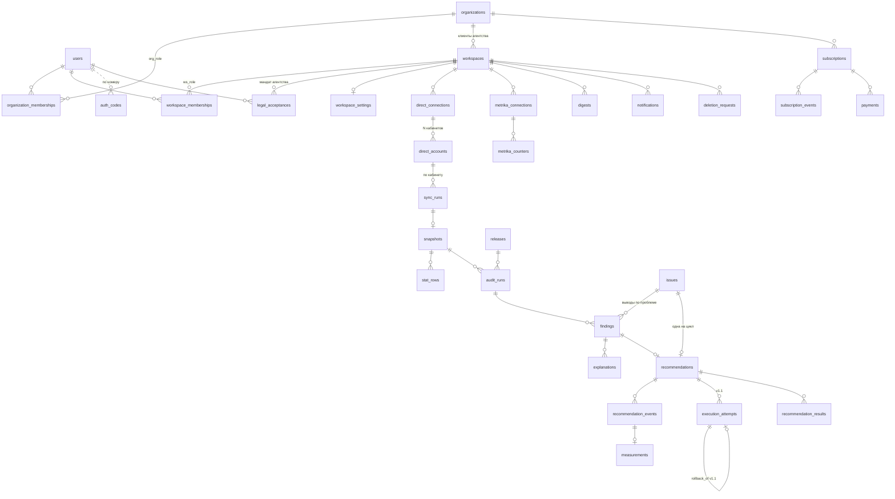

# Модель данных — v1.0

> Основа: [PRD.md](PRD.md) v1.0, [ARCHITECTURE.md](ARCHITECTURE.md), [API_CONTRACT.md](API_CONTRACT.md). **Точная схема — [backend/db/schema.sql](../backend/db/schema.sql)** (при расхождении в реализованном права она; инварианты проверяются тестами `backend/tests/test_schema.py`). Этот документ — смысл и состояния. PostgreSQL 16. Деньги — `numeric(14,2)` в рублях, даты периодов — `date` (МСК), моменты времени — `timestamptz`.

Обозначения: **[A]** — append-only (роль `app`: только `SELECT, INSERT`; `UPDATE/DELETE` запрещены триггером, кроме роли `deleter`). **[O]** — операционная таблица (`app` может `UPDATE`). **[schema]** — новое v1.0, уже реализованное в `schema.sql`. **[v1.0]** — целевая модель v1.0, в `schema.sql` ещё нет: появляется миграцией вместе с кодом, который её использует. **[v1.1]** — модель исполнения через Direct API (Deferred to v1.1): спроектирована, в v1.0 не создаётся и не обещается — в v1.0 AdPilot не изменяет рекламные кабинеты. Что в какой версии — [VERSION_SCOPE.md](VERSION_SCOPE.md); риск, capability, предусловия и откат (v1.1) — [EXECUTION_SAFETY.md](EXECUTION_SAFETY.md), [API_CONTRACT_EXECUTION.md](API_CONTRACT_EXECUTION.md); exposure — [ECONOMICS.md](ECONOMICS.md); AI — [AI_GOVERNANCE.md](AI_GOVERNANCE.md).

## 1. Карта сущностей



## 2. Пользователи и доступ

### `users` [O]
| Поле | Тип | |
|---|---|---|
| id | bigint PK | |
| phone_e164 | text UNIQUE NOT NULL | **[v1.0]** российский мобильный (`+7…`, E.164) — способ входа; это ПД, оператор — мы |
| phone_verified_at | timestamptz | **[v1.0]** момент первого успешного кода; без него пользователя нет |
| email | citext NULL | **[v1.0: NULL]** необязательный контакт (чеки, биллинг), не способ входа |
| status | `active` · `deactivated` | удалённый пользователь — удалённая строка, отдельного статуса нет |
| created_at, deactivated_at | timestamptz | |

Пароля нет: `password_hash`, подтверждение email и сброс пароля в v1.0 не вводятся.

### `auth_codes` [O] [v1.0]
Одноразовый SMS-код входа. `id`, `phone_e164`, `code_hash` (сам код — только в SMS, 6 цифр), `created_at`, `expires_at` (= `created_at` + 5 мин), `attempts` smallint (CHECK ≤ 5; пятая неверная попытка гасит код), `used_at` NULL. Принимается только неиспользованный, неистёкший, с `attempts < 5`. Регистрация и вход — один поток: номер новый → пользователь создаётся после кода только вместе с `legal_acceptances` (`offer`, `pd_consent`) в одной транзакции. Лимиты: повтор не чаще 1 раза в 60 с, 5 кодов в час на номер (запрос по `auth_codes`), 20 в час на IP (§11 п. 6) → `429`. SMS-провайдер — российский. Законность входа по SMS через агрегатор (ст. 10 149-ФЗ) — открытый пункт LEGAL.md: до заключения юриста регистрация на HOLD, запасной вариант — Яндекс ID.

### `auth_tokens` [O] [v1.0]
Только `purpose = invitation`: `id`, `organization_id`, `token_hash` (sha256; токен — только в ссылке приглашения), `expires_at`, `used_at`. Одноразовый. Куда уходит приглашение (номер или email) — §11 п. 5.

### `yandex_identities` [O] — выводится в v1.0
Вход через Яндекс ID (`yandex_uid`) — модель MVP, реализована в `auth/login.py` и остаётся до отдельного PR входа. В v1.0 вход — по номеру телефона (`auth_codes`), Яндекс OAuth — только подключения (§3). Таблица удаляется миграцией в PR входа по SMS; Яндекс ID как резервный способ входа (v1.1+) потребует её вернуть или завести заново.

### `sessions` [O]
`id` (случайный 256 бит, в httpOnly cookie хранится он; в БД — sha256), `user_id`, `created_at`, `expires_at`, `revoked_at`. Workspace в сессии не хранится — он в пути запроса (API_CONTRACT.md §1).

### `organizations` [O] [schema]
`id`, `name`, `kind` (`business` · `agency`), `created_at`. Владелец тарифа, лимитов и команды. Собственник бизнеса — организация `business` с одним workspace; агентство — `agency` с workspace на каждого клиента. На решения `kind` не влияет (в v1.1 кворум задаёт `approval_policy`, §2 `workspace_settings`). Без RLS (нужна до выбора workspace); меняется только функциями `SECURITY DEFINER` с проверкой, что actor — `owner` / `admin` (§9.5).

### `workspaces` [O]
`id`, `organization_id` **[schema]**, `name`, `status` (`active` · `deactivated` · `deletion_pending`), `created_at`, `deactivated_at`. `organization_id` неизменяем (триггер): клиент не переносится в другую организацию вместе с историей. «Удалён» — строки нет (её удаляет `delete_workspace_data`). Workspace = один клиент: его подключения, снимки, рекомендации.

### `organization_memberships` [O] [schema]
PK (`user_id`, `organization_id`), `org_role`: `owner` · `admin` · `member`. `owner` / `admin` видят и ведут все workspace организации с полными правами (всё, что `approver`, плюс команда, интеграции, биллинг); удалить организацию — только `owner`. `member` видит **только** workspace, где у него есть `workspace_memberships`, остальные для него не существуют (`404`). Хотя бы один `owner` на организацию — триггер. Удаление участника из организации удаляет его `workspace_memberships`. Без RLS; приглашение, смена роли и удаление участника — только функциями `SECURITY DEFINER` с проверкой, что actor — `owner` / `admin` этой организации (прямой записи у `app_rw` нет); выдать роль `owner`, изменить или удалить `owner` может только `owner`. Проверка «хотя бы один owner» сериализуется по строке организации (параллельные понижения не оставят организацию без владельца).

### `workspace_memberships` [O] [schema]
PK (`user_id`, `workspace_id`), `ws_role`: `approver` (смотреть, decide; **[v1.1]** + approve, execute) · `analyst` (смотреть, decide; **[v1.1]** + execute только одобренного) · `viewer` (только смотреть). Строка возможна только у участника той же организации (составной FK через `organization_id` → `organization_memberships`). Права — API_CONTRACT.md §10. Прежняя `memberships` (роль `owner` на workspace) заменена этими двумя таблицами.

### `workspace_settings` [O]
| Поле | Тип | Источник |
|---|---|---|
| workspace_id | PK | |
| target_cpa | numeric NULL | user_input. NULL → правило сравнивает с `baseline_cpa` (PRD §4.1); baseline не хранится в настройках — считается в каждом аудите и лежит в `findings.evidence` |
| avg_check | numeric NULL | user_input |
| lead_to_sale_rate | numeric(5,4) NULL | user_input, 0..1 |
| notify_pct_threshold | smallint | 10 / 15 / 20, `CHECK` |
| attribution_model | text | фиксируется при подключении |
| approval_policy | jsonb | **[v1.1]** уровень риска → число **разных** одобривших: по умолчанию `{"medium": 1, "high": 1, "critical": 2}` (`low` зарезервирован). CHECK: ключи из перечисления, значения ≥ 1. Меняет owner/admin; `critical` ниже 2 — только явным действием owner, это событие в журнале (§11 п. 7) |
| updated_at | timestamptz | |

Изменения настроек не ломают воспроизводимость: `audit_runs.settings` хранит замороженную копию. `approval_mode` (`single_step` / `two_step` по `kind`) убран: в v1.1 число одобрений задаёт риск действия (EXECUTION_SAFETY.md); в v1.0 решение принимает один человек с правом decide.

### `telegram_links` [O] — не используется в v1.0
Telegram в AdPilot не используется (D15, VERSION_SCOPE §3.2). Таблица (`user_id` PK, `chat_id` UNIQUE, `linked_at`) осталась в схеме и в релизной миграции `0001_baseline`; к удалению отдельной миграцией (документация код не меняет).

## 3. Подключения

### `direct_connections` [O]
| Поле | Тип | |
|---|---|---|
| id | bigint PK | |
| workspace_id | → workspaces | |
| yandex_login | text | чей токен |
| token_enc | bytea | AES-GCM; ключ вне БД |
| token_expires_at | timestamptz | |
| scopes | text[] | фактически выданные |
| write_access | `granted` · `denied` · `unknown` | **[v1.1]** может ли этот токен менять кампании аккаунта (права в Директе зависят от роли пользователя, например представитель «только чтение»). Обновляется по факту ответа API, как `status` |
| status | enum, §8.1 | |
| status_detail | text NULL | код ошибки API, без ПД |
| status_changed_at, last_sync_at | timestamptz | |

### `direct_accounts` [O]
`id`, `direct_connection_id`, `client_login` NULL (NULL — собственный аккаунт; значение — клиентский доступ через `Client-Login`), `is_selected` bool, `status`, UNIQUE(`direct_connection_id`, `client_login`).
**[schema]** Workspace → N `direct_connections` → N `direct_accounts`. `is_selected` = «включён в анализ», выбранных может быть несколько (индекс «ровно один» снят). Сколько — лимит тарифа `max_ad_accounts` через `can()` (§7), а не схема. Синхронизация, снимок и аудит — по каждому кабинету (`sync_runs.direct_account_id`); вывод и рекомендация несут кабинет через снимок и `issue_key` — в UI видно, к какому кабинету они относятся.

### `metrika_connections` [O]
Та же форма, что `direct_connections`.

### `metrika_counters` [O]
`id`, `metrika_connection_id`, `counter_id` bigint, `is_selected`, `goal_ids` bigint[] (цели, считающиеся конверсиями), UNIQUE(`metrika_connection_id`, `counter_id`).

## 4. Доказательная цепочка

### `releases` [A]
`id`, `commit_sha` char(40), `build_id` text, `released_at`. UNIQUE(`commit_sha`, `build_id`). Строка создаётся при старте процесса, если такой ещё нет.

### `sync_runs` [O]
`id`, `workspace_id`, `direct_account_id`, `metrika_counter_id` NULL, `kind` (`free_audit` · `scheduled` · `resync`), `status` (§8.2), `started_at`, `finished_at`, `error_code` NULL.

### `snapshots` [A]
| Поле | Тип | |
|---|---|---|
| id | bigint PK | |
| workspace_id | | |
| sync_run_id | UNIQUE | один снимок на запуск |
| created_at | timestamptz | |
| period_from, period_to | date | загруженный диапазон |
| data_until | timestamptz | данные включительно до |
| partial_from | date | даты ≥ этой → `data_status = partial` |
| sources | text[] | какие источники реально загружены (`yandex_direct`, `yandex_metrika`); `direct_placements` — отчёт площадок РСЯ был в синхронизации и пришёл (без него правило площадок не вычисляется) |
| release_id | → releases | каким кодом загружено и разобрано |

### `stat_rows` [A]
Агрегаты по allowlist. Одна таблица для всех уровней — меньше кода, одни и те же запросы.

**Зернистость: одна строка = одно наблюдение** — снимок · источник · уровень · кампания · объект · день. Уникальность — два частичных индекса (с кампанией и без); уровни Директа всегда с `campaign_id`, без кампании — только `site_goal` Метрики (CHECK); на уровне `campaign` `object_id = campaign_id` (CHECK). Один запрос в двух кампаниях за день — две строки. Измерения, которые не храним (тип площадки, условие показа), складываются в одну строку при синхронизации.

| Поле | Тип | |
|---|---|---|
| snapshot_id | → snapshots | |
| source | `yandex_direct` · `yandex_metrika` | |
| level | `campaign` · `adgroup` · `query` · `placement` · `hour` · `region` · `site_goal` | |
| object_id | bigint | ID кампании/группы/площадки/региона; для запросов — ID из `search_query_texts` |
| campaign_id | bigint NULL | родитель, для фильтрации |
| date | date | |
| impressions, clicks | bigint | |
| cost | numeric(14,2) | ₽ с НДС как в Директе — зафиксировать при интеграции |
| conversions | numeric(12,2) NULL | по выбранным целям; NULL если Метрика не подключена |
| revenue | numeric(14,2) NULL | e-commerce / ценность целей, если есть |

Уникальность — два частичных индекса по зернистости (см. выше), первичного ключа нет. Партиционирование по `snapshot_id` — потом, когда таблица превысит ~100 млн строк.

### `legal_acceptances` [A]
Принятые пользователем документы: `document` (`offer` · `pd_consent` · `marketing` · `agency_client_mandate`), `version` (дата редакции), `accepted_at` и поля доказательности (ниже). Каждый документ — отдельная строка (согласие на ПД — отдельно от оферты, 156-ФЗ); новая редакция или отзыв — новая строка. Пишется в транзакции создания пользователя (`auth/login.py`; **[v1.0]** — после проверки кода); без `offer` **и** `pd_consent` пользователь не создаётся. `ip` / `user_agent` скрыты от `app_rw` (нет `SELECT` на столбцы) и обнуляются через 30 дней после деактивации пользователя (ретеншн под `app_deleter`). При удалении пользователя его принятия обезличиваются функцией удаления: `user_id`, `ip`, `user_agent` → NULL; `document`, `version`, `document_sha256`, `accepted_at` остаются. Срок хранения доказательств — открытый вопрос юристу (LEGAL.md). Мандат агентства пишется при добавлении клиента. См. LEGAL.md.
**[schema] Доказательность:** `document_sha256` (хэш точного текста редакции, который видел пользователь; реестр версий и хэшей — `app/legal/documents.py`, `VERSIONS`), `locale`, `ip` inet, `user_agent` (≤ 256 символов). `workspace_id` — только у `agency_client_mandate` (CHECK): агентство подтверждает право передавать данные клиента, поручение клиента на обработку рекламных данных и право дать AdPilot доступ к его Директу. Без этой строки workspace организации `agency` не подключает Директ (§9.3 №14).

### `search_query_texts` [A, отдельный срок хранения]
`id`, `workspace_id`, `text_sanitized`, `text_hash` (sha256 исходного текста — чтобы один запрос в разных снимках был одной строкой), `first_seen_at`. UNIQUE(`workspace_id`, `text_hash`).
Появления — в `search_query_sightings` (`query_id`, `seen_at`), чтобы обе таблицы оставались append-only. Текст удаляется, когда последнее появление старше 60 дней.
После удаления текста агрегаты в `stat_rows` остаются, UI показывает «текст запроса удалён по сроку хранения».

### `placement_names` [A, данные workspace]
Имена площадок РСЯ для `stat_rows.object_id` уровня `placement` (хэш имени): `workspace_id`, `id`, `name` — PK (`workspace_id`, `id`), RLS, удаляется в `delete_workspace_data` (миграция 0005; до неё справочник был глобальным). Имя — домен/приложение после `sanitize_placement`, CHECK повторяет allowlist.

### `audit_runs` [A]
`id`, `workspace_id`, `snapshot_id`, `release_id`, `kind` (`free` · `scheduled`), UNIQUE(`snapshot_id`, `kind`), `settings` jsonb (замороженная копия `workspace_settings` + пороги уведомлений), `rules_run` text[] (какие `rule_version` запускались), `rules_skipped` jsonb (правило → причина: «нет Метрики»), `created_at`.

### `issues` [O] — идентичность проблемы
Стабильный ключ: `issue_key = sha256(workspace_id | direct_account_id | issue_type | object_type | object_id | dimension)`.
- `issue_type` — **семейство правила без версии**: `high_cpa` (общее для `high_cpa_target@N` и `high_cpa_baseline@N`), `zero_conv_campaign`, … Поэтому смена версии правила или то, что клиент задал target CPA, не создают «вторую ту же» проблему.
- `dimension` — уточнение внутри объекта для сегментных правил (`hour=3`, `region=213`), иначе пусто.
- Одна открытая проблема на ключ: частичный UNIQUE по `issue_key WHERE closed_at IS NULL`; одна рекомендация на проблему: UNIQUE(`recommendations.issue_id`). Инвариант «одна открытая рекомендация на проблему» держит база, а не код.
- Закрытие (`closed_at`, `close_reason`): `resolved` — проблема исчезла в аудите; `measured` — замерен результат выполненной рекомендации. **Отклонение не закрывает проблему:** пользователь сказал «нет» — повторять ту же рекомендацию каждый день не будем; проблема закроется, когда исчезнет.
- Проблема вернулась после закрытия → **новая строка `issues`, новый жизненный цикл**, новая рекомендация. `reopened` не вводим: история прошлого цикла остаётся нетронутой, связь — через общий `issue_key`.

### `findings` [A]
| Поле | Тип | |
|---|---|---|
| id | bigint PK | |
| audit_run_id | NOT NULL | |
| rule_version | text NOT NULL | `high_cpa@3` |
| object_type, object_id | text, bigint | |
| issue_id | → issues NOT NULL | к какой проблеме относится вывод (§4.1) |
| lost | jsonb `Value` | `CHECK (value_is_valid(lost))`. **`findings.lost` = exposure** — «Расход с признаками неэффективности ≈», всегда `estimated`; в API — поле `exposure`, имя колонки не меняем. Итог по workspace не хранится суммой — считается в `audit/exposure.py` (`exposure_total@1`) без двойного счёта (ECONOMICS.md) |
| recoverable | jsonb `Value` | `CHECK (value_is_valid(recoverable))` |
| confidence | `high` · `medium` · `low` | |
| evidence | jsonb `{имя: Value}` | `CHECK (evidence_is_valid(evidence))`; имена нужны шаблону объяснения |
| evidence_meta | jsonb | нечисловые доказательства: метод baseline, периоды, определение конверсии, атрибуция |
| action | jsonb | `{"type": "decrease_bid", "change_pct": -15}` |
| risk_level | `low` · `medium` · `high` · `critical` NULL | **[v1.1]** риск действия этой версии; NULL — исполнять нечего (`inspect_only`). Неизвестный тип действия → `critical` |
| risk_policy | text NULL | **[v1.1]** `risk_policy@1` — детерминированная функция в коде (EXECUTION_SAFETY.md); NULL ⇔ `risk_level` NULL (CHECK) |
| created_at | | |

`value_is_valid(jsonb)` — SQL-функция, проверяющая инварианты контракта (§5). Та же логика в pydantic; тест проверяет, что они согласованы на одном наборе примеров.

### `explanations` [A]
`id`, `finding_id`, `source` (`llm` · `template`), `provider`, `model`, `prompt_hash`, `text`, `release_id`, `created_at`. Если LLM-ответ не прошёл проверку (утверждения → доказательства, AI_GOVERNANCE.md) — сохраняется шаблонный (`source = template`), отклонённый ответ не хранится (в лог — факт отклонения без текста).

### `recommendations` [A]
`id`, `issue_id` UNIQUE NOT NULL, `finding_id` UNIQUE NOT NULL, `explanation_id` NOT NULL, `created_at`. Статуса в таблице нет — он выводится из событий. FK (`finding_id`, `issue_id`) → `findings`: вывод принадлежит той же проблеме.

### `recommendation_events` [A]
`id`, `recommendation_id`, `issue_id` (заполняет триггер из рекомендации), `type` (§8.3), `actor_user_id` NULL (NULL — система), `finding_id` NULL, `explanation_id` NULL, `result_id` NULL, `payload` jsonb, `execution_date` date NULL (только и обязательно у `done`: день выполнения в поясе данных), `created_at`.

**Точность `execution_date` гарантирует приложение, не БД.** API пишет `done` с одним моментом события `event_at`: `created_at = event_at`, `execution_date = execution_date(event_at)` (`ZoneInfo("Europe/Moscow")`). CHECK в БД — только санитарная вторая линия: `execution_date` в пределах ±1 дня от UTC-даты `created_at`. Ошибку на соседний день он не ловит (для 30.09 21:30 UTC верно 01.10, но 30.09 тоже пройдёт — `test_execution_date_db_check_is_sanity_only`). От этой даты зависят окна замера, поэтому писать `done` в обход `execution_date()` нельзя.

Ссылки на объекты — колонками с составными FK, не в JSON: (`finding_id`, `issue_id`) → `findings`, (`explanation_id`, `finding_id`) → `explanations`, (`result_id`, `recommendation_id`, `finding_id`) → `recommendation_results`. `finding_id` обязателен ровно у `seen_again` · `done` · `checked` · `measured`; `explanation_id` — у `seen_again`; `result_id` — у `measured`. Триггер: `done` и `checked` допустимы только над выводом, который показывали, и только по его `action_level` (§8.3) (исходный вывод рекомендации или пришедший через `seen_again`). В `payload` остаются только данные без идентичности (`until` у `postponed`).

**[v1.0] Типы событий** — §8.3. Переименования относительно MVP-схемы (миграция в PR жизненного цикла): `done` → `manual_claimed` (это заявление пользователя, а не факт исполнения), `checked` → `recommendation_checked`. Новые события v1.0: `accepted` (человек, `finding_id` версии обязателен, `payload.before_state` — параметры объекта, прочитанные сервером из Директа в момент `accept` (`Campaigns.get` и аналоги, только чтение); NULL — чтение не удалось). У `manual_claimed` без предшествующего `accepted` `payload.before_state` читается в момент отметки с `reliability = reduced` (сверка менее надёжна) и `verification_confirmed` / `verification_not_confirmed` (система, `payload`: прочитанное значение). У `rejected` появляется колонка `reason` (CHECK: `wrong_data` · `irrelevant_rule` · `not_enough_context` · `too_risky` · `other`; NOT NULL ⇔ `type = rejected`) и `payload.comment` (≤ 500 символов; обязателен при `other` — проверяет API; в LLM и уведомления не уходит). Правила `execution_date` и обязательного `finding_id` — у событий, после которых возможен замер: `manual_claimed` (в v1.1 — и `execution_succeeded`). Действиям человека (`accepted`, `postponed`, `rejected`, `recommendation_checked`, `manual_claimed`; в v1.1 — `approval_granted`, `cancelled`, `rollback_requested`) `actor_user_id` обязателен (CHECK); событиям системы (`verification_*`; в v1.1 — `approved`, `execution_*`, `rollback_succeeded/failed/blocked`) — `actor_user_id IS NULL`.

**[v1.1] Одобрение и кворум** (Deferred to v1.1, EXECUTION_SAFETY.md) — в v1.0 этих событий нет:
- `approval_granted` — одобрение одного человека: `actor_user_id`, `finding_id` (одобренная версия), колонка `precondition_hash` (обязательна у этого типа, CHECK) и `payload.expected_state` = `{object_ref, field, expected_current_value, action, target_value}` из предпросмотра; `precondition_hash` — хэш канонического JSON `expected_state` (тот же текущий параметр в повторном предпросмотре → тот же хэш). Частичный UNIQUE (`recommendation_id`, `finding_id`, `precondition_hash`, `actor_user_id`) — один человек засчитывается один раз (`same_approver`).
- Одобрение действительно 24 ч (`created_at` + 24 ч — константа политики, не колонка): истёкшее в кворум не входит, исполнение после срока → `approval_expired`.
- `approved` — системное событие «кворум набран»: пишется в той же транзакции, что и завершающее `approval_granted`, когда число **разных** авторов `approval_granted` с тем же `finding_id` и `precondition_hash`, не истёкших, ≥ `approval_policy[risk_level]`. `payload`: `risk_level`, требуемое число, id засчитанных одобрений, `precondition_hash`. До кворума статус — `requires_decision` («одобрено 1 из 2»).

### `execution_attempts` [A, кроме однократного `applied_value`] [v1.1]
**Deferred to v1.1** — в v1.0 таблица не создаётся. Одна попытка изменить Директ через API — исполнение или откат.

| Поле | Тип | |
|---|---|---|
| id | bigint PK | |
| recommendation_id, finding_id | | какую версию действия исполняем; FK (`finding_id`, `recommendation_id`) — та версия, которую одобрили |
| kind | `apply` · `rollback` | |
| rollback_of | → execution_attempts NULL | у `rollback` — какое исполнение откатываем |
| approved_event_id | → recommendation_events NOT NULL | кворум (`approved`), на основании которого действуем (у `rollback` — `rollback_requested`) |
| precondition_hash | text NOT NULL | = хэш засчитанных одобрений; у `rollback` — хэш ожидания «текущее = `applied_value` исполнения» |
| capability_version | text NOT NULL | `capabilities@N` — по какой записи реестра возможностей проверено и исполнено (EXECUTION_SAFETY.md) |
| idempotency_key | uuid UNIQUE | повтор запроса не создаёт второе изменение в Директе |
| before | jsonb | параметры объекта, перечитанные из Директа непосредственно перед записью |
| target | jsonb | что выставляем (у `rollback` — `before` исходного исполнения) |
| applied_value | jsonb NULL | значение, **подтверждённое перечитыванием** после записи; NULL — запись не подтверждена. Основа отката |
| created_at | timestamptz | |

Итог попытки — событиями рекомендации (`execution_started` → `execution_succeeded` / `execution_failed`, `rollback_*`) с `payload`: `provider_request_id`, `error_code`. Попытка неизменна: повтор после ошибки — новая строка с новым ключом; `applied_value` заполняется в той же транзакции, что и `execution_succeeded` (единственное допустимое изменение строки, один раз — триггер, как `sealed_at` у `snapshots`).
- **Предусловие.** Перед записью воркер перечитывает объект: `before` ≠ `expected_current_value` → записи нет, `execution_failed` с `state_changed`, рекомендация возвращается в `requires_decision` (нужны новый предпросмотр и новые одобрения). Одобрение старше 24 ч → `approval_expired`, так же. Действие не поддерживается для типа кампании/стратегии, нет права записи, поле неизменяемо, объект архивирован → `capability_unsupported`, запроса к Директу нет.
- **Откат** — попытка `kind = rollback`: доступен 7 дней после `execution_succeeded`, требует одного одобрения человека с правом approve (`rollback_requested`) независимо от риска. Гейт отката (EXECUTION_SAFETY.md §7): успешное исполнение через API · не прошло 7 дней · текущее значение == `applied_value` · право approve · подключение `connected` и `write_access = granted` · capability поддерживает обратное изменение; последняя версия вывода **не** требуется (ежедневный аудит создаёт новые версии). Текущее значение == `applied_value` исполнения → запись `before`. ≠ → записи нет, событие `rollback_blocked` с `state_changed_since_execution` и текущим значением в `payload` («параметр изменился после применения — проверьте вручную»).

### `recommendation_results` [A]
`id`, `recommendation_id`, `issue_id` (триггер), `finding_id` — замеренная версия действия, `measurement_id` (триггер: замер последнего `done`; FK (`measurement_id`, `recommendation_id`, `finding_id`)), `snapshot_id` (NULL только у `insufficient` без данных), `release_id`, `before` / `after` jsonb `{имя: Value}`, `saved` jsonb `Value` (`estimated`, с формулой; только при `effect`), `verdict` (`effect` · `no_effect` · `not_confirmed` — CPA снизился, но конверсий меньше · `insufficient`), `effect` jsonb (наблюдаемое изменение и причина вердикта), `created_at`. Триггер: `finding_id` результата = `finding_id` последнего `done`.

### `measurements` [A]
`id`, `done_event_id` UNIQUE, `recommendation_id`, `issue_id`, `finding_id`, `policy` (`high_cpa_measure@2`; `@1` — исторические замеры), `method` **[v1.0]** (`uncontrolled_before_after` — единственный в v1.0: 7 дней до и после без контрольной группы; `matched_control` · `experiment` — зарезервированы, CHECK), `before_from/to`, `after_from/to` (от `done.execution_date`), `created_at`. Создаётся триггером на `done` — ARCHITECTURE.md §5 (**[v1.0]** — на `manual_claimed`; **[v1.1]** — и на `execution_succeeded`). Определения конверсии в замере нет: оно читается из снимка выполненного вывода (`finding → audit_run_snapshots → snapshots`), копия могла бы разойтись с ним.

### `outbox_events` [O]
`id`, `workspace_id`, `event_type`, `aggregate_type`, `aggregate_id`, `payload` (только ID и числа), `created_at`, `available_at`, `attempts`, `locked_until`, `delivered_at`, `last_error` (код). Состояние — из полей доставки, без `status` — ARCHITECTURE.md §5.1.

## 5. Контракт `Value` в jsonb
```json
{"amount": "12400.00", "unit": "rub", "source": "yandex_direct",
 "period_from": "2026-09-22", "period_to": "2026-09-28",
 "calculation_type": "actual", "data_status": "partial", "data_sufficiency": "sufficient",
 "snapshot_id": 1847, "rule_version": null, "formula": null}
```
`value_is_valid` проверяет: все ключи есть; перечисления допустимы; `insufficient ⇔ unavailable ⇔ amount = null`; `estimated ⇒ formula not null`; `period_from ≤ period_to`. Необязательный `unavailable_reason` (миграция 0004): код из закрытого списка (`source_missing` · `no_conversions` · `history_insufficient` · `volume_insufficient` · `no_forecast` · `no_data`), допустим только при `unavailable`; в модели и API обязателен для `unavailable`, строки до 0004 читаются как `no_data` (API_CONTRACT §2).

## 6. Дайджесты и уведомления

### `digests` [A]
`id`, `workspace_id`, `kind` (`daily` · `weekly`), `snapshot_id`, `audit_run_id`, `payload` jsonb (все показанные `Value` + ID рекомендаций), `created_at`. Отправка — через `notifications`.

### `notifications` [O]
`id`, `workspace_id`, `kind` (`digest` · `correction` · `new_problem` · `critical` · `billing`), `channel` (целевое: `in_app` · `email`; в схеме пока `telegram` · `email` — приводится миграцией), `dedup_key` UNIQUE, `digest_id` NULL, `snapshot_id` NULL, `payload` jsonb, `status` (`queued` · `sent` · `failed` · `skipped`), `attempts`, `created_at`, `sent_at`.
`dedup_key` = `kind:workspace:object:date` — повтор не создаёт второе сообщение. `date` — день самого события в поясе данных, не день доставки: повторная доставка outbox-события на следующий день не даёт дубль. Причина `skipped` — `payload.skip_reason` (`subscription_inactive`, `workspace_inactive`, `no_recipient`).

## 7. Биллинг и бесплатный аудит

Тарифы и их функции — в коде (`billing/plans.py`), не в БД: меняются релизом, а не данными.

**[v1.0] Тариф → лимиты → использование** (PRD §7, «Тарификация агентств»). Тариф не привязан напрямую ни к пользователю, ни к рекламному кабинету. `plans.py` задаёт для тарифа набор лимитов (`entitlements`): `max_workspaces`, `max_ad_accounts`, `max_members`, `max_metrika_counters`, `max_clients`, `max_api_connections`, функции (**[v1.1]** `api_execution`, `ask_ai`, …). Использование (`usage`) не хранится — считается запросом по `workspaces`, `direct_accounts`, `organization_memberships`, `metrika_counters` организации. Проверка — одна функция `can(organization, feature | limit)` на бэкенде. Модель агентского тарифа (за кабинет или за участника) выбирается значениями лимитов, без изменения схемы.

### `subscriptions` [O]
`id`, `organization_id` **[v1.0: было `workspace_id`]**, `plan` (`start` · `business` · `business_plus`), `status` (§8.4), `price` numeric (цена на момент оформления), `current_period_start`, `current_period_end`, `auto_renew` bool, `renew_consent_at` timestamptz NULL (явное согласие на автопродление), `renew_consent_version` text NULL **[v1.0]** (редакция текста согласия), `payment_method_ref` text NULL (токен провайдера, **не** данные карты), `payment_method_refused_at` timestamptz NULL **[v1.0]**, `payment_method_refusal_channel` (`cabinet` · `email` · `support`) NULL **[v1.0]**, `payer_type` (`individual` · `ip` · `legal_entity`) **[v1.0]**, `canceled_at`.
Частичный UNIQUE: одна подписка в статусах `active`/`past_due`/`canceled` на организацию.
**[v1.0] Отказ от способа оплаты (376-ФЗ, LEGAL.md):** CHECK `payment_method_refused_at IS NULL OR (payment_method_ref IS NULL AND auto_renew = false)`. Отказ ≠ отмена: подписка может продолжаться с ручной оплатой. Воркер перед каждым списанием перечитывает подписку и не списывает при отказе; сохранённый способ удаляется и у провайдера.

### `subscription_events` [A]
`id`, `subscription_id`, `type` (`created` · `paid` · `renewal_reminder_sent` · `renewed` · `renewal_failed` · `canceled` · `expired` · `payment_method_refused` **[v1.0]**), `payload` (у `payment_method_refused` — канал), `created_at`. Отвечает на вопрос «почему списали / почему не списали».

### `payments` [O]
`id`, `subscription_id`, `provider` (`yookassa`), `provider_payment_id` UNIQUE (идемпотентность webhook), `amount`, `status` (`pending` · `succeeded` · `canceled` · `refunded`), `receipt_ref` NULL, `created_at`, `updated_at`.

### `free_audit_claims` [A]
`direct_account_hash` PK (HMAC-SHA256 от `client_login`/`yandex_login` с секретом вне БД), `claimed_at`. Без ссылок на workspace — переживает удаление аккаунта и не содержит логина.

## 8. Состояния

### 8.1 Подключение (Директ / Метрика)
```
            ┌───────────── переподключение ─────────────┐
            ▼                                            │
[нет] → connected ──ошибка API──▶ api_error ──успех──▶ connected
            │  ├──истёк токен──▶ token_expired ─────────┤
            │  ├──отозван──────▶ token_revoked ─────────┤
            │  └──нет прав─────▶ permission_missing ────┘
            └──пользователь отключил──▶ disconnected (токен удалён)
```
`api_error` — после 3 неудачных синхронизаций подряд (разовая ошибка — повтор, статус не меняется). Любой переход из `connected` → запись в `notifications` (`critical`).

### 8.2 Синхронизация
`queued → running → waiting_report (Reports API 201/202, опрос по retryIn) → running → succeeded | failed`. Снимок создаётся только при `succeeded` — частично загруженных снимков не бывает.

### 8.3 Рекомендация [v1.0]
Состояние — **основной `status` (6 значений v1.0) и независимые поля** `execution_mode` (`manual` · `none`), `verification_status`, `measurement` (API_CONTRACT.md §3). Ничего из этого не хранится колонкой: всё выводится из append-only `recommendation_events` — история фактическая и не зависит от трактовки статуса. В v1.0 AdPilot не изменяет рекламные кабинеты: изменение вносит человек, AdPilot сверяет его чтением.

```
new ──▶ requires_decision ──accepted──▶ accepted ──manual_claimed──▶ applied (manual) ── verification_* ── measured
             │   ▲                         ├──▶ postponed / rejected (reason)
             │   └──(дата)── postponed ◀───┘
             ├──▶ rejected (reason)          только review / change
             ├──▶ applied (manual)           «Выполнено вручную» без отдельного «Принять» — review / change
             └──▶ applied (none)             «Проверил» — inspect_only
```

| Событие | Кто | Переход / поле |
|---|---|---|
| `created` (строка `recommendations`) | система | → `new` |
| `viewed` · `delivered` | пользователь · система (уведомление доставлено) | `new` → `requires_decision`; повтор ничего не меняет |
| `accepted` | пользователь (decide) | → `accepted` «Принята к выполнению» (только `review` / `change`); `payload.before_state` — чтение параметров объекта из Директа в момент действия |
| `postponed` (`until`) | пользователь | → `postponed`; после даты — снова `requires_decision` |
| `rejected` (`reason`, `comment`) | пользователь | → `rejected` (только `review` / `change`); `reason` обязателен |
| `recommendation_checked` | пользователь | → `applied`, `execution_mode = none`, `verification_status = not_required` (только `inspect_only`) |
| `manual_claimed` | пользователь | → `applied`, `manual`, `verification_status = pending`; создаёт замер; без `accepted` — `payload.before_state` читается сейчас, `reliability = reduced` |
| `verification_confirmed` · `verification_not_confirmed` | система (сверка: чтение параметров из Директа) | только для `manual`: `verification_status` |
| `measured` · `measurement_skipped` | система | заполняют `measurement` (ARCHITECTURE.md §5) |
| `seen_again` | система | новая версия вывода; статус не меняется (`accepted` ссылается на версию, которую принимали) |

- **Ручное ≠ исполненное.** `manual_claimed` — заявление пользователя: AdPilot не утверждает, что изменение сделано. `verification_confirmed` пишется только когда синхронизация параметров затронутого объекта из Директа показала ожидаемое изменение относительно `before_state` из `accepted` (или из `manual_claimed` с `reliability = reduced`, если `accept` не было; ARCHITECTURE.md §4.2); до этого ручное выполнение остаётся `pending`. Автоматически «подтверждённым» оно не становится.
- **Неполные данные** (`data_status = partial`) решения v1.0 не блокируют — все они ручные; пометка видна в паспорте.
- **Решение относится к версии.** `accepted.finding_id` и `manual_claimed.finding_id` — версия, которую видел пользователь; при `seen_again` с другим `action` принятая версия устарела — UI показывает новую, `manual_claimed` по старой → `409 version_outdated`.
- `resolved` (проблема исчезла в аудите без действий) — закрытие **проблемы** (`issues.close_reason`), не статус рекомендации; в «Сэкономлено» не входит.

**[v1.1] Расширение без ломки** (Deferred to v1.1, API_CONTRACT_EXECUTION.md §1–2, EXECUTION_SAFETY.md): добавляются статусы `approved`, `failed`, `cancelled`, поля `execution_status`, `rollback_status`, `execution_mode = api` и события `approval_granted` (`finding_id`, `precondition_hash`), `approved` (кворум), `cancelled`, `execution_started` / `execution_succeeded` (→ `applied`, `api`, создаёт замер) / `execution_failed` (`state_changed` · `approval_expired` → `requires_decision`; иначе → `failed`), `rollback_requested` / `rollback_succeeded` / `rollback_failed` / `rollback_blocked`. Путь: `requires_decision` или `accepted` → кворум → `approved` → `applied (api)`. События и статусы v1.0 сохраняют смысл; `accepted` остаётся ручным путём. Правила v1.1: `approval_granted`, `approved`, `execution_*` невозможны при неполных данных (триггер); новая версия вывода, изменение параметра в Директе или 24 ч — одобрения устарели; `approve_and_apply` пишет `approval_granted`, `approved`, `execution_started` одной транзакцией тремя событиями.

**Состояния MVP-схемы** (реализованы в `schema.sql`, переводятся миграцией; `accepted`, `reason` у `rejected` и `verification_*` добавляются ею же): `new` → `new` / `requires_decision`; `checked` → `applied` + `none`; `done` → `applied` + `manual` + `claimed_manual`; `measured` → `applied` + `measurement`; `postponed`, `rejected` — без изменений.

**Пересчёт действия без новой рекомендации.** Аудит #1: CPA 5 000 → «снизить на 15%»; аудит #2: CPA 7 000 → «снизить на 25%». Проблема та же, рекомендация та же. Каждый аудит создаёт новый неизменяемый `finding` (со своим `action`) и `explanation` к нему; событие `seen_again` с колонками `finding_id`, `explanation_id` связывает их с рекомендацией. UI показывает последний вывод — история не переписывается. Отдельный тип события `recalculated` не нужен: это `seen_again`, у которого изменился `action`.

**Что именно выполнено.** `finding_id` у `accepted` и `manual_claimed` (в v1.1 — и у `approved`, `execution_succeeded`) обязателен (CHECK) и должен быть выводом этой же проблемы, который показывали (FK + триггер): пользователь решал, глядя на конкретную версию действия (−15% или −25%). Именно её замеряет `verify`.

**Разделение источников истины:** схема БД — для инвариантов; код — для бизнес-расчётов; события — для истории.

### 8.4 Подписка
```
[нет] → active ──(конец периода, auto_renew, оплата ок)──▶ active
           │──(оплата не прошла)──▶ past_due ──(3 дня, оплата ок)──▶ active
           │                           └──(3 дня, нет оплаты)──▶ expired
           └──(пользователь: «Отменить»)──▶ canceled ──(конец периода)──▶ expired
```
Стадия пользователя: `active`/`past_due`/`canceled` до конца периода → **Paid**; есть `free_audit` → **Free**; иначе → **Visitor**.

### 8.5 Аккаунт и удаление
```
workspace: active ──«деактивировать»──▶ deactivated ──«удалить данные»──▶ deletion_pending ──▶ deleted
                  └────────────────────────«удалить аккаунт»────────────────────────▲
```
- `deactivated`: доступ закрыт, OAuth-токены отозваны у Яндекса и удалены, синхронизация остановлена, подписка отменена. Данные на месте — можно вернуться.
- `deletion_pending` / `deleted` — через `deletion_requests`.

**Порядок удаления** записан в одном месте — SQL-функция `delete_workspace_data(ws)`: вызвать может только `app_deleter`, только для workspace в `deletion_pending`; возвращает число удалённых строк по таблицам (→ `deletion_requests.verification`). Платежи обезличиваются (`subscription_id = NULL`), отметка бесплатного аудита остаётся (в ней нет ПД). Проверено сквозным тестом `tests/test_lifecycle.py`.

### `deletion_requests` [O; сама запись — без ПД удалённого клиента]
| Поле | |
|---|---|
| id, workspace_id (NULL после завершения) | |
| requested_by | `user:<id>` · `system:retention` · `operator:<id>` |
| scope | `workspace` · `search_query_texts_expired` · `unreferenced_snapshots` |
| status | `requested → scheduled → deleting → verified → completed` · `failed` |
| requested_at, started_at, completed_at | |
| verification | jsonb: по каждому хранилищу — удалено N, осталось 0; для логов и бэкапов — дата истечения срока хранения |
| deleted_by | роль/процесс (`deleter@worker`) |

## 9. Согласованность состояний между объектами

Проверка, что `connection`, `sync`, `audit_run`, `recommendation`, `subscription`, `workspace`, `deletion_request` не создают противоречий.

### 9.1 Один охранник на все фоновые задачи
Каждая задача worker начинается с `guard(workspace_id, job)` — единственное место, где решается «можно ли работать»:

| Задача | workspace | подписка | подключение Директа | Если нельзя |
|---|---|---|---|---|
| бесплатный аудит | `active` | нет активной, claim свободен | `connected` | отказ с причиной в UI |
| плановая sync + аудит | `active` | Paid (`active` · `past_due` · `canceled` до конца периода) | `connected`, аккаунт `active` | `sync_runs.status = skipped`, `error_code` = причина; запросов к API и снимка нет |
| recheck доступа | `active` | — | есть токен (не `token_revoked`/`disconnected`); **аккаунт может быть `unavailable`** | `Skip(direct_unavailable, token_revoked)` — нужен новый OAuth |
| verify (+7 дней) | `active` | Paid | — (читает снимки, не API) | событие `measurement_skipped` с причиной, один раз; в «Сэкономлено» не входит |
| уведомление | `active` | Paid (кроме `billing`-уведомлений) | — | `notifications.status = skipped` |
| **[v1.1]** исполнение / откат через API (в v1.0 задачи нет) | `active` | Paid + лимит `api_execution` | `connected`, `write_access = granted`, аккаунт `active`; capability поддержана; исполнение — кворум с тем же `precondition_hash` не истёк, объект не изменился; откат — гейт EXECUTION_SAFETY.md §7 | событие `execution_failed` (`capability_unsupported` · `state_changed` · `approval_expired` · …) / `rollback_blocked` / `rollback_failed` с причиной; запроса на изменение к Директу нет |
| **[v1.0]** сверка ручного выполнения (только чтение параметров объекта) | `active` | Paid | `connected`, аккаунт `active` | `verification_status` остаётся `pending` |
| удаление | любой, кроме `deleted` | — | — | — |

Состояние проверяется в момент выполнения, а не постановки в очередь: задача, поставленная до деактивации, после неё ничего не сделает. Код — `app/worker/guard.py`: таблица `RULES` (задача → проверки по порядку), результат `Allow` · `Skip(reason)`. `RETRY` — не решение guard, а исход исполнения (`retryIn`, временная ошибка API): задача возвращается в очередь на интервал сервера. Воркер синхронизации вызывает guard дважды: до запросов к API и под блокировкой перед записью снимка.

**Здоровье подключений** (`app/worker/health.py`) — единственное место, где ответ API меняет статус. Доступ к аккаунту (`access_denied` · `account_not_found` · `api_restricted`) → `direct_accounts.unavailable` + причина; токен (`token_expired` · `token_revoked` · `permission_missing`) → `direct_connections.status` (при `token_revoked` токен удаляется); данные и временные ошибки (формат, `report_timeout`, `retryIn`) → только `sync_run`. Успешный авторизованный запрос (синхронизация или recheck) восстанавливает статус: `connected` / `active`, причина снята, `last_success_at`. Путь назад: `unavailable → recheck → active`. Подключение хранит текущее здоровье (`last_success_at`, `last_error`, `last_error_at`), `sync_run` — историю попытки.

### 9.2 Гонки
- **Sync ↔ удаление ↔ деактивация:** запись данных (снимок, аудит) берёт разделяемую `pg_advisory_xact_lock_shared(workspace_id)`, смена жизненного цикла (деактивация, удаление) — исключительную `pg_advisory_xact_lock(workspace_id)` (`app/worker/locks.py`). Синхронизации разных аккаунтов идут параллельно; удаление ждёт окончания записи и не пускает новые. Запросы к API — до блокировки: долгий отчёт не держит удаление.
- **Два аудита одного снимка:** UNIQUE(`audit_runs.snapshot_id`, `kind`) — повторный запуск задачи не создаёт дубль.
- **Повторный webhook оплаты:** UNIQUE(`payments.provider_payment_id`).
- **Webhook оплаты для удалённого workspace:** платёж записывается без подписки, алерт оператору — ручной возврат. Автоматически ничего не активируется.

### 9.3 Инварианты между объектами
| # | Инвариант | Как обеспечен |
|---|---|---|
| 0 | Ссылки только внутри своего workspace | триггер `check_same_workspace` (sync_runs, issues, digests, notifications, recommendation_results); иначе строка чужого workspace держала бы FK и ломала удаление. Второй барьер — RLS (§9.5) |
| 0a | `sync_run` и `issue` — только вперёд | `sync_run_lifecycle`: завершённый неизменен, идентичность заморожена; `issue_close_only`: единственное изменение — закрытие, один раз |
| 1 | Нет снимка без `succeeded` sync | снимок создаётся в той же транзакции, что и перевод sync в `succeeded` |
| 1a | Снимок атомарен, идемпотентен и запечатан | `app/sync/store.py`: снимок, тексты запросов, `stat_rows` и `succeeded` — одна транзакция; повтор того же `sync_run` возвращает тот же снимок (UNIQUE `sync_run_id`). Состояние снимка — `building → complete | failed`, только вперёд (триггер `snapshots_lifecycle`; меняются лишь `status` и `sealed_at`). Строки добавляются только в `building` (`stat_rows_sealed`); аудит, замер и дайджест — только на `complete` (`require_complete_snapshot`). Недоступный аккаунт — `sync_run.failed` с `error_code` + `error_reason`, снимка нет; один снимок = один аккаунт, аудит аккаунты не смешивает |
| 2 | Нет аудита без снимка, вывода без аудита, рекомендации без вывода и объяснения | FK `NOT NULL` |
| 3 | Одна открытая рекомендация на проблему | `issues`: частичный UNIQUE по `issue_key` + UNIQUE(`recommendations.issue_id`). Новый вывод по открытой проблеме → событие `seen_again(finding_id)`; UI показывает цифры последнего вывода |
| 4 | Проблема ушла сама → рекомендация не висит | в новом аудите нет вывода по `issue_key` → событие `resolved`, `issues.closed_at` |
| 5 | «Сэкономлено» только за подтверждённые действия | `recommendation_results` только после `manual_claimed` (v1.1 — и `execution_succeeded`) и только по выполненной версии действия (триггер); `saved` не NULL ⇔ `verdict = effect` (CHECK); в сумму «Сэкономлено» входит только при `manual` + `verification_confirmed` (v1.1 — и `api` + `succeeded` без успешного отката; запрос, не флаг); `resolved` не входит |
| 5b | **[v1.1]** Одно изменение в Директе на один кворум | `execution_attempts.idempotency_key` UNIQUE; не больше одной попытки `apply` в работе на рекомендацию (частичный UNIQUE); одобрение устаревает с новой версией вывода, сменой состояния объекта и через 24 ч |
| 5e | **[v1.1]** Кворум — разные люди, одно ожидаемое состояние | `approved` только при ≥ `approval_policy[risk_level]` не истёкших `approval_granted` разных `actor_user_id` с одинаковыми `finding_id` и `precondition_hash` (триггер); повтор того же человека — частичный UNIQUE; `execution_attempts.precondition_hash` = хэш кворума |
| 5f | **[v1.1]** Откат не перезаписывает чужое изменение | `rollback` пишет только если текущее значение == `applied_value` исполнения, иначе `rollback_blocked`; не позже 7 дней после `execution_succeeded` |
| 5c | **[v1.1]** Без полных данных — без API | `approved` / `execution_started` отклоняются триггером, если вывод версии `partial`; воркер перепроверяет перед запросом к Директу |
| 5g | **[v1.0]** AdPilot не пишет в рекламный кабинет | в v1.0 нет `execution_attempts` и событий исполнения (CHECK перечисления `recommendation_events.type`); клиент Директа — только методы чтения (тест, ARCHITECTURE.md §11) |
| 5h | **[v1.0]** Отклонение — с причиной | `rejected` ⇔ `reason` NOT NULL из закрытого списка (CHECK) |
| 5d | **[v1.0]** Изоляция workspace в API | каждый запрос API — через функции доступа с обязательным `workspace_id` и проверкой членства (`organization_memberships` owner/admin или `workspace_memberships`); тест: пользователь A не читает, не меняет и не узнаёт о существовании объектов B, включая вложенные (`history`, `evidence`); `member` без `workspace_memberships` — так же. RLS — §9.5 |
| 5a | Событие и результат не ссылаются на чужую проблему | составные FK через `issue_id` (§ `recommendation_events`); тесты `backend/tests/test_issue_integrity.py` |
| 6 | После `measured` проблема может вернуться | проблема закрыта → следующий вывод создаёт новую строку `issues` и новую рекомендацию |
| 7 | Одна активная подписка на организацию | частичный UNIQUE по `status IN ('active','past_due','canceled')` |
| 8 | Деактивация закрывает всё | одна транзакция: `workspace.status = deactivated`, подключения `disconnected` + токены удалены (отзыв у Яндекса — после коммита, с повтором), подписка `canceled` + `auto_renew = false`. **[v1.0]** Подписка — уровня организации: отменяется при деактивации последнего workspace организации или самой организации, а не одного клиента агентства |
| 9 | После `deletion_pending` не появляется новых данных | `guard` + advisory lock; API отвечает `410 Gone` |
| 10 | Кабинеты не смешиваются | снимок привязан к `direct_account_id`; аудит сравнивает только снимки одного кабинета; кабинетов в workspace может быть несколько (лимит `max_ad_accounts`) |
| 11 | Правило CPA и правило «нет конверсий» не срабатывают на одно | CPA-правило требует конверсий > 0 в оцениваемом периоде (PRD §4.1) |
| 12 | **[schema]** У организации всегда есть `owner` | триггер на `organization_memberships`: последнего `owner` нельзя удалить или понизить |
| 13 | **[schema]** Роль в workspace — только у участника организации | составной FK `workspace_memberships` → `organization_memberships`; удаление из организации удаляет ws-роли |
| 14 | **[v1.0]** Агентство не подключает Директ клиента без мандата | подключение проверяет строку `legal_acceptances` (`agency_client_mandate`, `workspace_id`) |
| 15 | **[v1.0]** Итог exposure без двойного счёта | `audit/exposure.py`: объединение затронутого расхода по кабинету · кампании · объекту · дню; итог ≤ суммы карточек и ≥ максимальной (golden-набор, AI_GOVERNANCE.md / ECONOMICS.md) |

### 9.4 Исполнение и автоматизация
В v1.0 исполнения через API нет: человек выполняет вручную, AdPilot сверяет чтением (§8.3). **[v1.1]** Исполнение — §8.3 (раздел v1.1): `execution_started` только после `approved` (или в одной транзакции с ним при `approve_and_apply`), `approved` — только при кворуме `approval_granted` людей с правом approve (`actor_user_id NOT NULL`, CHECK на тип события). Риск, capability, предусловие и откат — EXECUTION_SAFETY.md. Автоматизация v2.0 (PRD §10, вопрос 8) — только через явно одобренное правило со своей записью одобрения; до решения по нему схему не расширяем.

### 9.5 Изоляция арендаторов — RLS **[schema]**
Второй барьер после проверки членства в коде (`workspace_role`, `app/tenancy.py`).
- **`app_rw`** (API и задачи одного workspace; `app_token` — её член) видит только строки workspace из `app.workspace_id`: `workspace_id = app_workspace_id()`. API после проверки членства делает `SET LOCAL app.workspace_id`, воркер — на каждую задачу. Не выставлен — 0 строк: `SELECT * FROM recommendations` без фильтра не вернёт чужого клиента.
- **Дочерние таблицы без `workspace_id`** (`stat_rows`, `findings`, `recommendation_events`, `measurements`, `direct_accounts`, `payments`, …) — политика через `EXISTS` по родителю (`snapshots`, `issues`, подключения, подписки).
- **`app_system`** — член `app_rw` с политикой «все строки»: задачи по многим workspace (планировщик, захват и доставка outbox, уведомления, выбор замеров к запуску). Те же права на таблицы, что у `app_rw`.
- **Удаление и ретеншн** — функции `SECURITY DEFINER` под `app_deleter`; workspace — явный параметр.
- **Организационного контекста (`app.organization_id`) нет.** Без RLS: `users`, `sessions`, `yandex_identities`, `telegram_links` (приложение фильтрует по пользователю сессии), `organizations`, `organization_memberships` (нужны до выбора workspace), `releases`, `free_audit_claims`. Управление организацией и членством — только функциями `SECURITY DEFINER` с проверкой, что actor — `owner` / `admin`; `workspaces.organization_id` неизменяем. Функции токенов сверяют переданный workspace с `app.workspace_id`.
- Проверяется тестами (`tests/test_access.py`).

## 10. Индексы (основные)
- `stat_rows (snapshot_id, level, campaign_id)` — выборки аудита.
- `issues (issue_key) WHERE closed_at IS NULL` — «новая проблема или та же» (он же уникальный).
- `recommendation_events (recommendation_id, created_at DESC)` — текущий статус.
- `snapshots (workspace_id, created_at DESC)` — последний снимок.
- `notifications (status, created_at) WHERE status = 'queued'`.

## 11. Открытые вопросы
1. Расход в Директе — с НДС или без: хранить как в отчёте и подписывать в UI (проверить параметр отчёта при интеграции).
2. ~~Целевой CPA~~ — решено: target / baseline, PRD §4.1. Два правила: `high_cpa_target@1`, `high_cpa_baseline@1`.
3. Нужен ли `revenue` в MVP (e-commerce из Метрики) — поле заложено, заполняется только если у счётчика есть доход.
4. **[v1.1]** Срок хранения `execution_attempts.before/target/applied_value` после закрытия проблемы — сейчас «пока жив workspace», как остальная история решений.
5. Приглашение участника: на номер телефона или на email, и создаётся ли `workspace_memberships` вместе с приглашением.
6. ~~Лимит кодов на IP~~ — решено в коде (`app/auth/phone.py`, миграция 0002): IP хранится только как HMAC в журнале `phone_auth_events`, срок — 30 дней (`purge_phone_auth`); таблицы `phone_auth_codes` / `phone_auth_events` вместо `auth_codes`.
7. **[v1.1]** Где хранится журнал изменений `approval_policy` (в т. ч. снижение `critical` до 1 владельцем): отдельная append-only таблица не определена.
8. ~~RLS для дочерних таблиц и уровня организации~~ — решено (§9.5): дочерние — `EXISTS` по родителю; `app.organization_id` нет, организация и членство — без RLS, изменение только функциями `SECURITY DEFINER`.
9. **[v1.1]** Сменилась `approval_policy` между одобрениями — кворум по политике на момент завершающего одобрения или на момент первого.
10. Срок хранения обезличенных доказательств принятия (`legal_acceptances` после удаления пользователя) и номера `users.phone_e164` после удаления — LEGAL.md. `ip` / `user_agent` — решено: обнуляются через 30 дней после деактивации.
11. **[v1.1]** Код `reason` для отката после 7 дней: сейчас откат просто исчезает из `allowed_actions`.
12. ~~Гасит ли новый код предыдущий~~ — да (`superseded_at`, один живой код на номер). При `422 acceptance_required` код не гасится: проверка с `consume=False`.
13. **[v1.0]** Сверка ручного выполнения: сколько синхронизаций (дней) ждать изменения до `verification_not_confirmed` и как сверять действия без одного параметра (например, «проверить цели»: остаются `pending` или не сверяются).
14. **[v1.0]** Сверка при `reliability = reduced`: входит ли подтверждённый результат в «Сэкономлено» наравне с обычным или только показывается (сейчас — входит при `verification_confirmed`).
15. **[v1.0]** `reject` для `inspect_only`: сейчас недоступен (только «Проверил» / «Позже»); для метрики ложных срабатываний может понадобиться «Не буду» с `irrelevant_rule` и на «проверить».
