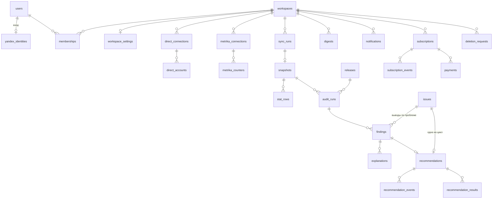

# Модель данных MVP — v0.1

> Основа: [PRD.md](PRD.md), [ARCHITECTURE.md](ARCHITECTURE.md). **Точная схема — [backend/db/schema.sql](../backend/db/schema.sql)** (при расхождении права она; инварианты проверяются тестами `backend/tests/test_schema.py`). Этот документ — смысл и состояния. PostgreSQL 16. Деньги — `numeric(14,2)` в рублях, даты периодов — `date` (МСК), моменты времени — `timestamptz`.

Обозначения: **[A]** — append-only (роль `app`: только `SELECT, INSERT`; `UPDATE/DELETE` запрещены триггером, кроме роли `deleter`). **[O]** — операционная таблица (`app` может `UPDATE`).

## 1. Карта сущностей



## 2. Пользователи и доступ

### `users` [O]
| Поле | Тип | |
|---|---|---|
| id | bigint PK | |
| email | text | из Яндекс ID, для уведомлений о биллинге |
| status | `active` · `deactivated` | удалённый пользователь — удалённая строка, отдельного статуса нет |
| created_at, deactivated_at | timestamptz | |

### `yandex_identities` [O]
`id`, `user_id` UNIQUE → users, `yandex_uid` UNIQUE, `login`, `created_at`. Только вход — токена доступа к рекламе здесь нет.

### `sessions` [O]
`id` (случайный 256 бит, в httpOnly cookie хранится он), `user_id`, `created_at`, `expires_at`, `revoked_at`.

### `workspaces` [O]
`id`, `name`, `status` (`active` · `deactivated` · `deletion_pending`), `created_at`, `deactivated_at`. «Удалён» — строки нет (её удаляет `delete_workspace_data`).

### `memberships` [O]
PK (`user_id`, `workspace_id`), `role` — в MVP только `owner` (`admin`/`viewer` — Бизнес+).

### `workspace_settings` [O]
| Поле | Тип | Источник |
|---|---|---|
| workspace_id | PK | |
| target_cpa | numeric NULL | user_input. NULL → правило сравнивает с `baseline_cpa` (PRD §4.1); baseline не хранится в настройках — считается в каждом аудите и лежит в `findings.evidence` |
| avg_check | numeric NULL | user_input |
| lead_to_sale_rate | numeric(5,4) NULL | user_input, 0..1 |
| notify_pct_threshold | smallint | 10 / 15 / 20, `CHECK` |
| attribution_model | text | фиксируется при подключении |
| updated_at | timestamptz | |

Изменения настроек не ломают воспроизводимость: `audit_runs.settings` хранит замороженную копию.

### `telegram_links` [O]
`user_id` PK, `chat_id` UNIQUE, `linked_at`. Одноразовый токен deep-link — в Redis с TTL 15 минут.

## 3. Подключения

### `direct_connections` [O]
| Поле | Тип | |
|---|---|---|
| id | bigint PK | |
| workspace_id | → workspaces | |
| yandex_login | text | чей токен |
| token_enc | bytea | AES-GCM; ключ вне БД |
| token_expires_at | timestamptz | |
| scopes | text[] | фактически выданные |
| status | enum, §8.1 | |
| status_detail | text NULL | код ошибки API, без ПД |
| status_changed_at, last_sync_at | timestamptz | |

### `direct_accounts` [O]
`id`, `direct_connection_id`, `client_login` NULL (NULL — собственный аккаунт; значение — клиентский доступ через `Client-Login`), `is_selected` bool, `status`, UNIQUE(`direct_connection_id`, `client_login`). В MVP выбран ровно один (частичный уникальный индекс по `workspace` где `is_selected`).

### `metrika_connections` [O]
Та же форма, что `direct_connections`.

### `metrika_counters` [O]
`id`, `metrika_connection_id`, `counter_id` bigint, `is_selected`, `goal_ids` bigint[] (цели, считающиеся конверсиями), UNIQUE(`metrika_connection_id`, `counter_id`).

## 4. Доказательная цепочка

### `releases` [A]
`id`, `commit_sha` char(40), `build_id` text, `released_at`. UNIQUE(`commit_sha`, `build_id`). Строка создаётся при старте процесса, если такой ещё нет.

### `sync_runs` [O]
`id`, `workspace_id`, `direct_account_id`, `metrika_counter_id` NULL, `kind` (`free_audit` · `scheduled` · `resync`), `status` (§8.2), `started_at`, `finished_at`, `error_code` NULL.

### `snapshots` [A]
| Поле | Тип | |
|---|---|---|
| id | bigint PK | |
| workspace_id | | |
| sync_run_id | UNIQUE | один снимок на запуск |
| created_at | timestamptz | |
| period_from, period_to | date | загруженный диапазон |
| data_until | timestamptz | данные включительно до |
| partial_from | date | даты ≥ этой → `data_status = partial` |
| sources | text[] | какие источники реально загружены (`yandex_direct`, `yandex_metrika`) |
| release_id | → releases | каким кодом загружено и разобрано |

### `stat_rows` [A]
Агрегаты по allowlist. Одна таблица для всех уровней — меньше кода, одни и те же запросы.

**Зернистость: одна строка = одно наблюдение** — снимок · источник · уровень · кампания · объект · день. Уникальность — два частичных индекса (с кампанией и без); уровни Директа всегда с `campaign_id`, без кампании — только `site_goal` Метрики (CHECK); на уровне `campaign` `object_id = campaign_id` (CHECK). Один запрос в двух кампаниях за день — две строки. Измерения, которые не храним (тип площадки, условие показа), складываются в одну строку при синхронизации.

| Поле | Тип | |
|---|---|---|
| snapshot_id | → snapshots | |
| source | `yandex_direct` · `yandex_metrika` | |
| level | `campaign` · `adgroup` · `query` · `placement` · `hour` · `region` · `site_goal` | |
| object_id | bigint | ID кампании/группы/площадки/региона; для запросов — ID из `search_query_texts` |
| campaign_id | bigint NULL | родитель, для фильтрации |
| date | date | |
| impressions, clicks | bigint | |
| cost | numeric(14,2) | ₽ с НДС как в Директе — зафиксировать при интеграции |
| conversions | numeric(12,2) NULL | по выбранным целям; NULL если Метрика не подключена |
| revenue | numeric(14,2) NULL | e-commerce / ценность целей, если есть |

Уникальность — два частичных индекса по зернистости (см. выше), первичного ключа нет. Партиционирование по `snapshot_id` — потом, когда таблица превысит ~100 млн строк.

### `search_query_texts` [A, отдельный срок хранения]
`id`, `workspace_id`, `text_sanitized`, `text_hash` (sha256 исходного текста — чтобы один запрос в разных снимках был одной строкой), `first_seen_at`. UNIQUE(`workspace_id`, `text_hash`).
Появления — в `search_query_sightings` (`query_id`, `seen_at`), чтобы обе таблицы оставались append-only. Текст удаляется, когда последнее появление старше 60 дней.
После удаления текста агрегаты в `stat_rows` остаются, UI показывает «текст запроса удалён по сроку хранения».

### `audit_runs` [A]
`id`, `workspace_id`, `snapshot_id`, `release_id`, `kind` (`free` · `scheduled`), UNIQUE(`snapshot_id`, `kind`), `settings` jsonb (замороженная копия `workspace_settings` + пороги уведомлений), `rules_run` text[] (какие `rule_version` запускались), `rules_skipped` jsonb (правило → причина: «нет Метрики»), `created_at`.

### `issues` [O] — идентичность проблемы
Стабильный ключ: `issue_key = sha256(workspace_id | direct_account_id | issue_type | object_type | object_id | dimension)`.
- `issue_type` — **семейство правила без версии**: `high_cpa` (общее для `high_cpa_target@N` и `high_cpa_baseline@N`), `zero_conv_campaign`, … Поэтому смена версии правила или то, что клиент задал target CPA, не создают «вторую ту же» проблему.
- `dimension` — уточнение внутри объекта для сегментных правил (`hour=3`, `region=213`), иначе пусто.
- Одна открытая проблема на ключ: частичный UNIQUE по `issue_key WHERE closed_at IS NULL`; одна рекомендация на проблему: UNIQUE(`recommendations.issue_id`). Инвариант «одна открытая рекомендация на проблему» держит база, а не код.
- Закрытие (`closed_at`, `close_reason`): `resolved` — проблема исчезла в аудите; `measured` — замерен результат выполненной рекомендации. **Отклонение не закрывает проблему:** пользователь сказал «нет» — повторять ту же рекомендацию каждый день не будем; проблема закроется, когда исчезнет.
- Проблема вернулась после закрытия → **новая строка `issues`, новый жизненный цикл**, новая рекомендация. `reopened` не вводим: история прошлого цикла остаётся нетронутой, связь — через общий `issue_key`.

### `findings` [A]
| Поле | Тип | |
|---|---|---|
| id | bigint PK | |
| audit_run_id | NOT NULL | |
| rule_version | text NOT NULL | `high_cpa@3` |
| object_type, object_id | text, bigint | |
| issue_id | → issues NOT NULL | к какой проблеме относится вывод (§4.1) |
| lost | jsonb `Value` | `CHECK (value_is_valid(lost))` |
| recoverable | jsonb `Value` | `CHECK (value_is_valid(recoverable))` |
| confidence | `high` · `medium` · `low` | |
| evidence | jsonb `{имя: Value}` | `CHECK (evidence_is_valid(evidence))`; имена нужны шаблону объяснения |
| evidence_meta | jsonb | нечисловые доказательства: метод baseline, периоды, определение конверсии, атрибуция |
| action | jsonb | `{"type": "decrease_bid", "change_pct": -15}` |
| created_at | | |

`value_is_valid(jsonb)` — SQL-функция, проверяющая инварианты контракта (§5). Та же логика в pydantic; тест проверяет, что они согласованы на одном наборе примеров.

### `explanations` [A]
`id`, `finding_id`, `source` (`llm` · `template`), `provider`, `model`, `prompt_hash`, `text`, `release_id`, `created_at`. Если LLM-ответ не прошёл проверку чисел — сохраняется шаблонный (`source = template`), отклонённый ответ не хранится (в лог — факт отклонения без текста).

### `recommendations` [A]
`id`, `issue_id` UNIQUE NOT NULL, `finding_id` UNIQUE NOT NULL, `explanation_id` NOT NULL, `created_at`. Статуса в таблице нет — он выводится из событий. FK (`finding_id`, `issue_id`) → `findings`: вывод принадлежит той же проблеме.

### `recommendation_events` [A]
`id`, `recommendation_id`, `issue_id` (заполняет триггер из рекомендации), `type` (§8.3), `actor_user_id` NULL (NULL — система), `finding_id` NULL, `explanation_id` NULL, `result_id` NULL, `payload` jsonb, `execution_date` date NULL (только и обязательно у `done`: день выполнения в поясе данных), `created_at`.

**Точность `execution_date` гарантирует приложение, не БД.** API пишет `done` с одним моментом события `event_at`: `created_at = event_at`, `execution_date = execution_date(event_at)` (`ZoneInfo("Europe/Moscow")`). CHECK в БД — только санитарная вторая линия: `execution_date` в пределах ±1 дня от UTC-даты `created_at`. Ошибку на соседний день он не ловит (для 30.09 21:30 UTC верно 01.10, но 30.09 тоже пройдёт — `test_execution_date_db_check_is_sanity_only`). От этой даты зависят окна замера, поэтому писать `done` в обход `execution_date()` нельзя.

Ссылки на объекты — колонками с составными FK, не в JSON: (`finding_id`, `issue_id`) → `findings`, (`explanation_id`, `finding_id`) → `explanations`, (`result_id`, `recommendation_id`, `finding_id`) → `recommendation_results`. `finding_id` обязателен ровно у `seen_again` · `done` · `measured`; `explanation_id` — у `seen_again`; `result_id` — у `measured`. Триггер: `done` допустим только над выводом, который показывали (исходный вывод рекомендации или пришедший через `seen_again`). В `payload` остаются только данные без идентичности (`until` у `postponed`).

### `recommendation_results` [A]
`id`, `recommendation_id`, `issue_id` (триггер), `finding_id` — замеренная версия действия, `measurement_id` (триггер: замер последнего `done`; FK (`measurement_id`, `recommendation_id`, `finding_id`)), `snapshot_id` (NULL только у `insufficient` без данных), `release_id`, `before` / `after` jsonb `{имя: Value}`, `saved` jsonb `Value` (`estimated`, с формулой; только при `effect`), `verdict` (`effect` · `no_effect` · `insufficient`), `effect` jsonb (наблюдаемое изменение и причина вердикта), `created_at`. Триггер: `finding_id` результата = `finding_id` последнего `done`.

### `measurements` [A]
`id`, `done_event_id` UNIQUE, `recommendation_id`, `issue_id`, `finding_id`, `policy` (`high_cpa_measure@1`), `before_from/to`, `after_from/to` (от `done.execution_date`), `created_at`. Создаётся триггером на `done` — ARCHITECTURE.md §5. Определения конверсии в замере нет: оно читается из снимка выполненного вывода (`finding → audit_run_snapshots → snapshots`), копия могла бы разойтись с ним.

### `outbox_events` [O]
`id`, `workspace_id`, `event_type`, `aggregate_type`, `aggregate_id`, `payload` (только ID и числа), `created_at`, `available_at`, `attempts`, `locked_until`, `delivered_at`, `last_error` (код). Состояние — из полей доставки, без `status` — ARCHITECTURE.md §5.1.

## 5. Контракт `Value` в jsonb
```json
{"amount": "12400.00", "unit": "rub", "source": "yandex_direct",
 "period_from": "2026-09-22", "period_to": "2026-09-28",
 "calculation_type": "actual", "data_status": "partial", "data_sufficiency": "sufficient",
 "snapshot_id": 1847, "rule_version": null, "formula": null}
```
`value_is_valid` проверяет: все ключи есть; перечисления допустимы; `insufficient ⇔ unavailable ⇔ amount = null`; `estimated ⇒ formula not null`; `period_from ≤ period_to`.

## 6. Дайджесты и уведомления

### `digests` [A]
`id`, `workspace_id`, `kind` (`daily` · `weekly`), `snapshot_id`, `audit_run_id`, `payload` jsonb (все показанные `Value` + ID рекомендаций), `created_at`. Отправка — через `notifications`.

### `notifications` [O]
`id`, `workspace_id`, `kind` (`digest` · `correction` · `new_problem` · `critical` · `billing`), `channel` (`telegram` · `email`), `dedup_key` UNIQUE, `digest_id` NULL, `snapshot_id` NULL, `payload` jsonb, `status` (`queued` · `sent` · `failed` · `skipped`), `attempts`, `created_at`, `sent_at`.
`dedup_key` = `kind:workspace:object:date` — повтор не создаёт второе сообщение.

## 7. Биллинг и бесплатный аудит

Тарифы и их функции — в коде (`billing/plans.py`), не в БД: меняются релизом, а не данными.

### `subscriptions` [O]
`id`, `workspace_id`, `plan` (`start` · `business` · `business_plus`), `status` (§8.4), `price` numeric (цена на момент оформления), `current_period_start`, `current_period_end`, `auto_renew` bool, `renew_consent_at` timestamptz NULL (явное согласие на автопродление), `payment_method_ref` text NULL (токен провайдера, **не** данные карты), `canceled_at`.
Частичный UNIQUE: одна подписка в статусах `active`/`past_due`/`canceled` на workspace.

### `subscription_events` [A]
`id`, `subscription_id`, `type` (`created` · `paid` · `renewal_reminder_sent` · `renewed` · `renewal_failed` · `canceled` · `expired`), `payload`, `created_at`. Отвечает на вопрос «почему списали / почему не списали».

### `payments` [O]
`id`, `subscription_id`, `provider` (`yookassa`), `provider_payment_id` UNIQUE (идемпотентность webhook), `amount`, `status` (`pending` · `succeeded` · `canceled` · `refunded`), `receipt_ref` NULL, `created_at`, `updated_at`.

### `free_audit_claims` [A]
`direct_account_hash` PK (HMAC-SHA256 от `client_login`/`yandex_login` с секретом вне БД), `claimed_at`. Без ссылок на workspace — переживает удаление аккаунта и не содержит логина.

## 8. Состояния

### 8.1 Подключение (Директ / Метрика)
```
            ┌───────────── переподключение ─────────────┐
            ▼                                            │
[нет] → connected ──ошибка API──▶ api_error ──успех──▶ connected
            │  ├──истёк токен──▶ token_expired ─────────┤
            │  ├──отозван──────▶ token_revoked ─────────┤
            │  └──нет прав─────▶ permission_missing ────┘
            └──пользователь отключил──▶ disconnected (токен удалён)
```
`api_error` — после 3 неудачных синхронизаций подряд (разовая ошибка — повтор, статус не меняется). Любой переход из `connected` → запись в `notifications` (`critical`).

### 8.2 Синхронизация
`queued → running → waiting_report (Reports API 201/202, опрос по retryIn) → running → succeeded | failed`. Снимок создаётся только при `succeeded` — частично загруженных снимков не бывает.

### 8.3 Рекомендация (текущий статус = последнее событие)
```
new ──▶ postponed ──(дата)──▶ new
 │
 ├──▶ rejected (с причиной, опционально)
 ├──▶ done (пользователь отметил «Выполнено»)
 │        └──(+7 дней, задача verify)──▶ measured {effect | no_effect | insufficient}
 └──▶ resolved (проблема исчезла в следующем аудите без действий пользователя)
```
Служебные события, не меняющие статус: `seen_again` (проблема подтвердилась новым аудитом), `measurement_skipped` (замер невозможен: подписка/подключение неактивны).

**Пересчёт действия без новой рекомендации.** Аудит #1: CPA 5 000 → «снизить на 15%»; аудит #2: CPA 7 000 → «снизить на 25%». Проблема та же, рекомендация та же. Каждый аудит создаёт новый неизменяемый `finding` (со своим `action`) и `explanation` к нему; событие `seen_again` с колонками `finding_id`, `explanation_id` связывает их с рекомендацией. UI показывает последний вывод — история не переписывается. Отдельный тип события `recalculated` не нужен: это `seen_again`, у которого изменился `action`.

**Что именно выполнил человек.** `done.finding_id` обязателен (CHECK) и должен быть выводом этой же проблемы, который показывали (FK + триггер): пользователь нажал «Выполнено», глядя на конкретную версию действия (−15% или −25%). Именно её замеряет `verify`.

**Разделение источников истины:** схема БД — для инвариантов; код — для бизнес-расчётов; события — для истории.
v2.0 добавит между `new` и `done`: `approved → applying → applied | apply_failed` и `rolled_back` — отдельными типами событий, без изменения схемы.

### 8.4 Подписка
```
[нет] → active ──(конец периода, auto_renew, оплата ок)──▶ active
           │──(оплата не прошла)──▶ past_due ──(3 дня, оплата ок)──▶ active
           │                           └──(3 дня, нет оплаты)──▶ expired
           └──(пользователь: «Отменить»)──▶ canceled ──(конец периода)──▶ expired
```
Стадия пользователя: `active`/`past_due`/`canceled` до конца периода → **Paid**; есть `free_audit` → **Free**; иначе → **Visitor**.

### 8.5 Аккаунт и удаление
```
workspace: active ──«деактивировать»──▶ deactivated ──«удалить данные»──▶ deletion_pending ──▶ deleted
                  └────────────────────────«удалить аккаунт»────────────────────────▲
```
- `deactivated`: доступ закрыт, OAuth-токены отозваны у Яндекса и удалены, синхронизация остановлена, подписка отменена. Данные на месте — можно вернуться.
- `deletion_pending` / `deleted` — через `deletion_requests`.

**Порядок удаления** записан в одном месте — SQL-функция `delete_workspace_data(ws)`: вызвать может только `app_deleter`, только для workspace в `deletion_pending`; возвращает число удалённых строк по таблицам (→ `deletion_requests.verification`). Платежи обезличиваются (`subscription_id = NULL`), отметка бесплатного аудита остаётся (в ней нет ПД). Проверено сквозным тестом `tests/test_lifecycle.py`.

### `deletion_requests` [O; сама запись — без ПД удалённого клиента]
| Поле | |
|---|---|
| id, workspace_id (NULL после завершения) | |
| requested_by | `user:<id>` · `system:retention` · `operator:<id>` |
| scope | `workspace` · `search_query_texts_expired` · `unreferenced_snapshots` |
| status | `requested → scheduled → deleting → verified → completed` · `failed` |
| requested_at, started_at, completed_at | |
| verification | jsonb: по каждому хранилищу — удалено N, осталось 0; для логов и бэкапов — дата истечения срока хранения |
| deleted_by | роль/процесс (`deleter@worker`) |

## 9. Согласованность состояний между объектами

Проверка, что `connection`, `sync`, `audit_run`, `recommendation`, `subscription`, `workspace`, `deletion_request` не создают противоречий.

### 9.1 Один охранник на все фоновые задачи
Каждая задача worker начинается с `guard(workspace_id, job)` — единственное место, где решается «можно ли работать»:

| Задача | workspace | подписка | подключение Директа | Если нельзя |
|---|---|---|---|---|
| бесплатный аудит | `active` | нет активной, claim свободен | `connected` | отказ с причиной в UI |
| плановая sync + аудит | `active` | Paid (`active` · `past_due` · `canceled` до конца периода) | `connected`, аккаунт `active` | `sync_runs.status = skipped`, `error_code` = причина; запросов к API и снимка нет |
| recheck доступа | `active` | — | есть токен (не `token_revoked`/`disconnected`); **аккаунт может быть `unavailable`** | `Skip(direct_unavailable, token_revoked)` — нужен новый OAuth |
| verify (+7 дней) | `active` | Paid | — (читает снимки, не API) | событие `measurement_skipped` с причиной, один раз; в «Сэкономлено» не входит |
| уведомление | `active` | Paid (кроме `billing`-уведомлений) | — | `notifications.status = skipped` |
| удаление | любой, кроме `deleted` | — | — | — |

Состояние проверяется в момент выполнения, а не постановки в очередь: задача, поставленная до деактивации, после неё ничего не сделает. Код — `app/worker/guard.py`: таблица `RULES` (задача → проверки по порядку), результат `Allow` · `Skip(reason)`. `RETRY` — не решение guard, а исход исполнения (`retryIn`, 429): задача возвращается в очередь на интервал сервера. Воркер синхронизации вызывает guard дважды: до запросов к API и под блокировкой перед записью снимка.

**Здоровье подключений** (`app/worker/health.py`) — единственное место, где ответ API меняет статус. Доступ к аккаунту (`access_denied` · `account_not_found` · `api_restricted`) → `direct_accounts.unavailable` + причина; токен (`token_expired` · `token_revoked` · `permission_missing`) → `direct_connections.status` (при `token_revoked` токен удаляется); данные и временные ошибки (формат, `report_timeout`, `retryIn`) → только `sync_run`. Успешный авторизованный запрос (синхронизация или recheck) восстанавливает статус: `connected` / `active`, причина снята, `last_success_at`. Путь назад: `unavailable → recheck → active`. Подключение хранит текущее здоровье (`last_success_at`, `last_error`, `last_error_at`), `sync_run` — историю попытки.

### 9.2 Гонки
- **Sync ↔ удаление ↔ деактивация:** запись данных (снимок, аудит) берёт разделяемую `pg_advisory_xact_lock_shared(workspace_id)`, смена жизненного цикла (деактивация, удаление) — исключительную `pg_advisory_xact_lock(workspace_id)` (`app/worker/locks.py`). Синхронизации разных аккаунтов идут параллельно; удаление ждёт окончания записи и не пускает новые. Запросы к API — до блокировки: долгий отчёт не держит удаление.
- **Два аудита одного снимка:** UNIQUE(`audit_runs.snapshot_id`, `kind`) — повторный запуск задачи не создаёт дубль.
- **Повторный webhook оплаты:** UNIQUE(`payments.provider_payment_id`).
- **Webhook оплаты для удалённого workspace:** платёж записывается без подписки, алерт оператору — ручной возврат. Автоматически ничего не активируется.

### 9.3 Инварианты между объектами
| # | Инвариант | Как обеспечен |
|---|---|---|
| 0 | Ссылки только внутри своего workspace | триггер `check_same_workspace` (sync_runs, issues, digests, notifications, recommendation_results); иначе строка чужого workspace держала бы FK и ломала удаление |
| 0a | `sync_run` и `issue` — только вперёд | `sync_run_lifecycle`: завершённый неизменен, идентичность заморожена; `issue_close_only`: единственное изменение — закрытие, один раз |
| 1 | Нет снимка без `succeeded` sync | снимок создаётся в той же транзакции, что и перевод sync в `succeeded` |
| 1a | Снимок атомарен, идемпотентен и запечатан | `app/sync/store.py`: снимок, тексты запросов, `stat_rows` и `succeeded` — одна транзакция; повтор того же `sync_run` возвращает тот же снимок (UNIQUE `sync_run_id`). Состояние снимка — `building → complete | failed`, только вперёд (триггер `snapshots_lifecycle`; меняются лишь `status` и `sealed_at`). Строки добавляются только в `building` (`stat_rows_sealed`); аудит, замер и дайджест — только на `complete` (`require_complete_snapshot`). Недоступный аккаунт — `sync_run.failed` с `error_code` + `error_reason`, снимка нет; один снимок = один аккаунт, аудит аккаунты не смешивает |
| 2 | Нет аудита без снимка, вывода без аудита, рекомендации без вывода и объяснения | FK `NOT NULL` |
| 3 | Одна открытая рекомендация на проблему | `issues`: частичный UNIQUE по `issue_key` + UNIQUE(`recommendations.issue_id`). Новый вывод по открытой проблеме → событие `seen_again(finding_id)`; UI показывает цифры последнего вывода |
| 4 | Проблема ушла сама → рекомендация не висит | в новом аудите нет вывода по `issue_key` → событие `resolved`, `issues.closed_at` |
| 5 | «Сэкономлено» только за действия пользователя | `recommendation_results` только после `done` и только по выполненной версии действия (триггер); `saved` не NULL ⇔ `verdict = effect` (CHECK); `resolved` в KPI не входит |
| 5a | Событие и результат не ссылаются на чужую проблему | составные FK через `issue_id` (§ `recommendation_events`); тесты `backend/tests/test_issue_integrity.py` |
| 6 | После `measured` проблема может вернуться | проблема закрыта → следующий вывод создаёт новую строку `issues` и новую рекомендацию |
| 7 | Одна активная подписка на workspace | частичный UNIQUE по `status IN ('active','past_due','canceled')` |
| 8 | Деактивация закрывает всё | одна транзакция: `workspace.status = deactivated`, подписка `canceled` + `auto_renew = false`, подключения `disconnected` + токены удалены (отзыв у Яндекса — после коммита, с повтором) |
| 9 | После `deletion_pending` не появляется новых данных | `guard` + advisory lock; API отвечает `410 Gone` |
| 10 | Смена рекламного аккаунта не смешивает данные | снимок привязан к `direct_account_id`; аудит сравнивает только снимки одного аккаунта |
| 11 | Правило CPA и правило «нет конверсий» не срабатывают на одно | CPA-правило требует конверсий > 0 в оцениваемом периоде (PRD §4.1) |

### 9.4 v2.0 без противоречий
`approved → applying → applied | apply_failed → rolled_back` добавляются событиями рекомендации. Инвариант на будущее: `applying` возможен только из `approved`, `approved` — только событием пользователя (`actor_user_id NOT NULL`, `CHECK` на тип события). Автоматизация (PRD, открытый вопрос 8) — только через явно одобренное правило, со своей записью одобрения; до решения по нему схему не расширяем.

## 10. Индексы (основные)
- `stat_rows (snapshot_id, level, campaign_id)` — выборки аудита.
- `issues (issue_key) WHERE closed_at IS NULL` — «новая проблема или та же» (он же уникальный).
- `recommendation_events (recommendation_id, created_at DESC)` — текущий статус.
- `snapshots (workspace_id, created_at DESC)` — последний снимок.
- `notifications (status, created_at) WHERE status = 'queued'`.

## 11. Открытые вопросы
1. Расход в Директе — с НДС или без: хранить как в отчёте и подписывать в UI (проверить параметр отчёта при интеграции).
2. ~~Целевой CPA~~ — решено: target / baseline, PRD §4.1. Два правила: `high_cpa_target@1`, `high_cpa_baseline@1`.
3. Нужен ли `revenue` в MVP (e-commerce из Метрики) — поле заложено, заполняется только если у счётчика есть доход.
